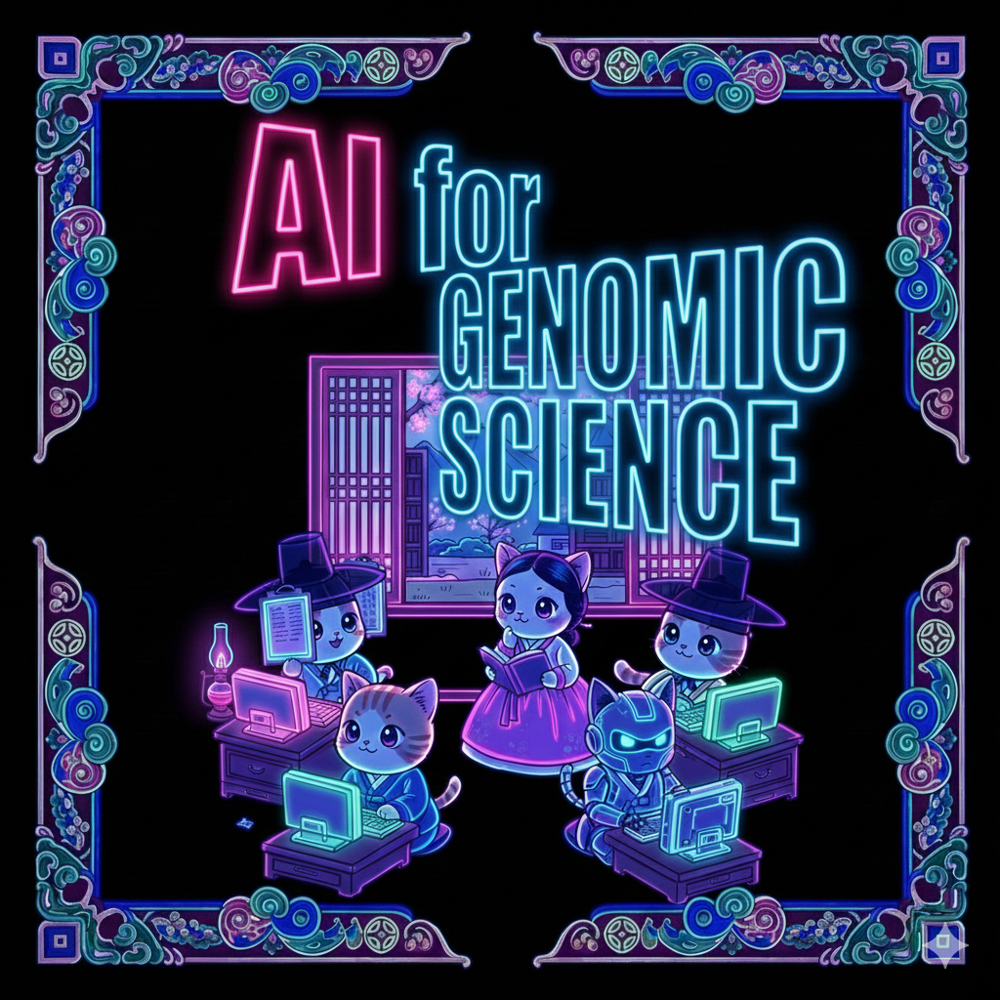

# AI for Genomic Science

Welcome to **AI for Genomic Science**

Author: [*Joon-Yong An*, Korea University](https://joonanlab.github.io/team/)

*Last Update: 2025/11/2* (Under Construction - probably weekly update by 2026 if I am not lazy enough..)

---

## About This Book

This textbook introduces how artificial intelligence is revolutionizing biological research — from analyzing genetic variants to modeling entire cells. It is designed specifically for **3rd-year (junior/senior) biology undergraduates** who want to understand the computational approaches that are transforming genomics, without requiring prior experience in AI or advanced programming.

The field of genomics has been rapidly transformed by machine learning, deep learning, and large-scale computational methods. These advances now allow us to analyze massive genomic datasets, predict functional impacts of variants, and model complex biological systems with unprecedented accuracy. This textbook takes a biology-first approach to cover the essential AI concepts and methods that undergraduate students need to master, integrating computational techniques with genomic applications.

This book is written for **biology majors** who have a solid foundation in molecular biology and genetics, are curious about computational approaches, want to understand the **why** and **how** behind AI methods in genomics, and are comfortable with basic mathematics. Rather than assuming extensive programming background, we start from the basics and build up gradually, emphasizing conceptual understanding alongside practical applications.

All 17 chapters are now available, organized into 5 parts. Each chapter includes an **interactive companion page** with hands-on simulations and visualizations to reinforce key concepts.

---

## What Makes This Book Different?

### 🧬 Biology-First Approach
Each chapter starts with a **real biological challenge**—experimental limitations that motivate computational solutions. You'll never wonder "why do I need to learn this?"

### 💻 Hands-On Coding Labs
Every chapter includes **Google Colab-based coding exercises**. No installation needed—just click and start learning! All code is heavily commented and designed for beginners.

### 🎯 Clear Mathematical Explanations
Math concepts are explained in **Math Boxes** with biological examples. We won't shy away from equations, but we'll make sure you understand what they mean.

### 📚 Real Case Studies
Learn from actual research papers and real datasets. See how these methods are being used to make biological discoveries right now.

---

## What You'll Learn

By the end of this book, you will be able to:

✅ Understand the fundamental concepts of machine learning and deep learning  
✅ Explain how AI methods predict the effects of genetic variants  
✅ Use pre-trained models to analyze genomic sequences  
✅ Interpret results from tools like CADD, DeepSEA, Enformer, and DNABERT  
✅ Understand how language models are applied to DNA and RNA sequences  
✅ Analyze single-cell omics data using foundation models  
✅ Critically evaluate AI-based studies in genomics literature  
✅ Write basic Python code for bioinformatics analyses  

---

## Book Structure

This textbook is organized into **five parts**:

### Part 1: Foundations of AI for Biology (Chapters 1–4)
Learn the essential AI concepts every biologist should know — from Bayesian intuition to neural network architectures.

### Part 2: Genomics Foundations and Traditional Methods (Chapters 5–7)
Understand how traditional and machine learning methods help us characterize genetic variation and interpret variant effects.

### Part 3: Deep Learning for Genomics (Chapters 8–10)
Explore how CNNs and transformers predict regulatory elements and variant effects directly from DNA sequences.

### Part 4: Language Models and Foundation Models (Chapters 11–14)
Discover how NLP techniques power DNA language models and genomic foundation models, from BERT-style architectures to next-generation long-context models.

### Part 5: Single-Cell Genomics and Whole-Cell Modeling (Chapters 15–17)
See how AI is resolving cell-type heterogeneity at single-cell resolution and driving progress toward whole-cell computational models.

---

## How to Use This Book

### For Self-Study:
1. Read each chapter sequentially — concepts build on each other
2. Open the **Interactive companion page** linked at the top of every chapter for hands-on exploration
3. Work through the **Coding Labs** in Google Colab
4. Try the **Discussion Questions** to deepen your understanding
5. Explore the **Further Reading** for topics that interest you

### For Classroom Use:
- Each chapter is designed for 1-2 weeks of instruction
- Coding labs can be used as homework or in-class activities
- Discussion questions are great for group work
- Case studies make excellent presentation topics

### Prerequisites:
- **Biology**: Molecular biology, genetics (sophomore/junior level)
- **Math**: Algebra, basic statistics (we'll review when needed)
- **Programming**: None required! We start from scratch
- **Enthusiasm**: Essential! 🎉

---

## Getting Started

### Setting Up Your Environment

All coding exercises use **Google Colab**, which runs in your web browser. You'll need:
1. A Google account (free)
2. Internet connection
3. That's it!

No software installation required. We'll walk you through everything in Chapter 1.

---

## Quick Navigation

**Part 1: Foundations of AI for Biology**

* [Chapter 1: Why AI for Genomic Science?](chapters/chapter1.md)
* [Chapter 2: From Biological Intuition to Deep Learning](chapters/chapter2.md)
* [Chapter 3: Neural Networks — How Machines Learn Patterns](chapters/chapter3.md)
* [Chapter 4: Neural Network Architectures](chapters/chapter4.md)

**Part 2: Genomics Foundations and Traditional Methods**

* [Chapter 5: Genetic Variation and Genomic Technologies](chapters/chapter5.md)
* [Chapter 6: Evolutionary Conservation and Traditional Tools](chapters/chapter6.md)
* [Chapter 7: Machine Learning Ensemble Methods for Variant Interpretation](chapters/chapter7.md)

**Part 3: Deep Learning for Genomics**

* [Chapter 8: The Rise of Deep Learning in Genomics](chapters/chapter8.md)
* [Chapter 9: CNN-Based Regulatory Sequence Analysis](chapters/chapter9.md)
* [Chapter 10: Transformer-Based Models for Genomics](chapters/chapter10.md)

**Part 4: Language Models and Foundation Models**

* [Chapter 11: Introduction to Language Models](chapters/chapter11.md)
* [Chapter 12: Foundation Models for Genomics](chapters/chapter12.md)
* [Chapter 13: DNA Language Models](chapters/chapter13.md)
* [Chapter 14: Next-Generation DNA Models](chapters/chapter14.md)

**Part 5: Single-Cell Genomics and Whole-Cell Modeling**

* [Chapter 15: Introduction to Single-Cell Omics](chapters/chapter15.md)
* [Chapter 16: Single-Cell Foundation Models](chapters/chapter16.md)
* [Chapter 17: Toward Whole-Cell Modeling](chapters/chapter17.md)

---

*Happy Learning! 🧬🤖*

---

## License

License information to be added

