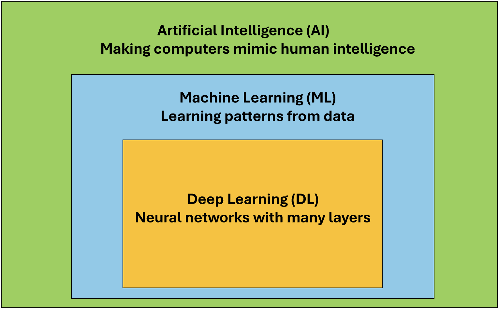
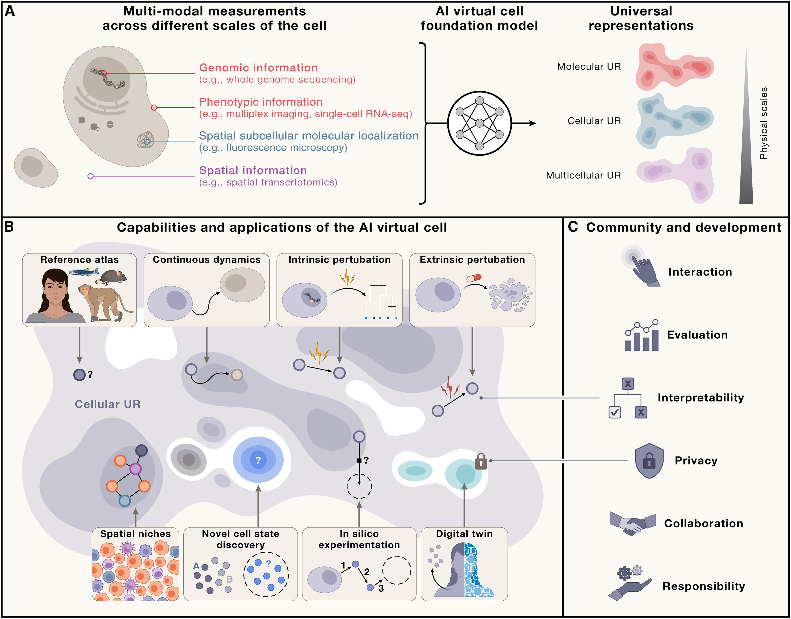

# Chapter 1: Why AI for Genomic Science?

Dr. Sarah An stares at her computer screen, frustrated. She just received whole-genome sequencing (WGS) data from a 7-year-old patient with a complex rare disorder—severe skeletal abnormalities, neurodevelopmental delays, and metabolic dysfunction. Both parents are healthy, suggesting this is a *de novo* (new) mutation. The WGS reveals 4.5 million genetic variants compared to the reference genome. Her computational pipeline identifies approximately 70 de novo variants—changes found in the patient but not in either parent. These are the prime suspects. She runs standard pathogenicity prediction tools—CADD scores and PolyPhen-2—to narrow down the list. After filtering, she's left with 3 coding mutations** in genes with unknown function or disease relevance, and 7 noncoding variants** in regulatory regions. 

Any of these 10 variants could be causative. But which one?

Each functional validation experiment takes 2-3 months and costs $8,000-15,000. Testing all 10 would take **2+ years** and over **$100,000**. Even then, the noncoding variants are challenging to test—their effects on gene regulation are subtle and context-dependent, requiring cell-type-specific assays, enhancer reporter experiments, and potentially CRISPR editing in patient-derived cells. Three days later, using an AI-powered variant prioritization model trained on millions of variants and functional genomics data, Sarah narrows the list to **2 high-confidence candidates**: one coding variant in a gene involved in skeletal development with a damaging structural prediction, and one noncoding variant in an enhancer predicted to disrupt binding of a critical transcription factor expressed in developing bone and neural tissue. Within two months, functional experiments confirm the noncoding variant as causative—it disrupts an enhancer driving expression of a gene essential for both skeletal and neural development.

This is one example how we can leverage the power of AI in genomics: not replacing scientific intuition, but dramatically amplifying it to navigate the vast search space of human genetic variation.

---

## The Biological Challenge

Modern biology faces two unprecedented explosions.

**Data Explosion**: Whole genome sequencing can easily read a single human genome of approximately 3 billion nucleotides, with each person having 3-5 million variants that differ from one another. Single-cell RNA-seq experiments generate data from millions of cells, while various epigenome sequencing techniques can provide information for chromatin accessibility maps across millions of genomic regions. Proteomics technologies can identify hundreds of millions of peptide sequences from a single experiment.

**Many Hypothesis to be explored**: Large-scale genomics studies don't just generate data but they also generate thousands of testable hypotheses. GWAS studies identify hundreds of loci associated with each complex trait, but most are in noncoding regions with unknown mechanisms. Genome sequencing in rare disease cohorts reveals dozens of candidate genes per patient, each requiring functional validation. Cancer genomics finds hundreds of somatic mutations per tumor, but only a subset are "driver" mutations versus neutral "passengers." Single-cell atlases reveal thousands of cell type-specific gene expression patterns, each suggesting regulatory hypotheses. Spatial transcriptomics shows genes co-expressed in tissue neighborhoods, implicating thousands of potential cell-cell interactions.

**Systems-Level Complexity**: The challenge isn't just quantity but the complexity inherent in our cells and tissues. Genes operate in networks, not isolation, and a single phenotype often involves dozens to hundreds of genes working together. Context matters profoundly: the same variant can be benign in one genetic background but pathogenic in another, and gene function depends on cell type, developmental stage, and environmental conditions. Combinatorial interactions add another layer of complexity, where two variants individually benign might be harmful together, causing the number of possible combinations to explode exponentially. Pleiotropic effects further complicate the picture: one gene affects multiple phenotypes while one phenotype is affected by multiple genes, creating a many-to-many mapping rather than a simple one-to-one relationship.

The fundamental problem is that we can generate biological data and hypotheses far faster than we can experimentally test them. A single GWAS might implicate 500 genes, and testing each would take decades. AI helps us predict which experiments to prioritize and which hypotheses are most likely to be true.

---

## The Hierarchy of Artificial Intelligence (AI): From Broad to Specific

**Artificial Intelligence** is the broadest concept—any technique that enables computers to mimic human intelligence. This includes playing chess, recognizing faces, translating languages, predicting protein structures, and classifying cell types.

### Machine Learning (ML)

**Machine Learning** is a subset of AI focused on one question:

> *"Can computers learn patterns from data instead of having humans program every rule explicitly?"*

Instead of telling a computer "if the DNA sequence has TATA box at position -25 and GC content > 60%, it's probably a promoter," we give the computer thousands of examples of promoters and non-promoters, and let it figure out the patterns. The learning process works by having the algorithm compare its predictions to the correct answers, measure the error, and then automatically adjust its approach through mathematical optimization.

What Is "Learning" in Machine Learning? Here is an example for "Predicting variant functional impact".

You have:
- **Input:** Conservation score, population frequency, predicted structural change
- **Output:** Likely functional impact or neutral

The algorithm learns by:

1. **Making initial guesses** (usually random)
2. **Comparing to known answers** (labeled training data)
3. **Measuring error** (calculating "loss")
4. **Adjusting internal parameters** to reduce error
5. **Repeating thousands of times**

This adjustment process is optimization—finding the best parameters that minimize prediction errors.

For a simple model, the algorithm discovers the best weights: 

```
Score = (Conservation × w₁) + (Frequency × w₂) + (StructuralChange × w₃) + bias
```

The algorithm discovers the best values for w₁, w₂, w₃, and bias by examining thousands of examples. We don't tell the algorithm what values to use—it discovers them from data.

### Deep Learning (DL)

**Deep Learning** uses **artificial neural networks** with many layers to automatically discover patterns in data. Each layer builds on the previous one in a hierarchical fashion. The first layer might detect simple sequence motifs such as TATA or CAAT boxes, while the second layer might combine these motifs to detect larger regulatory modules. The third layer might identify context-dependent regulatory logic, and the fourth layer might predict cell-type-specific enhancer activity.

### The Hierarchy in Practice



**Figure 1.1: The AI Hierarchy - From Broad to Specific.**

**Genomic Tool Examples:**

| Tool | Category | Why? |
|------|----------|------|
| BLAST | AI (not ML) | Uses programmed rules for alignment |
| Random Forest classifier | ML (not DL) | Learns from data, no neural networks |
| AlphaFold | DL | Deep neural networks with many layers |


---

## Correlation vs. Causation: What AI Can and Cannot Tell You

### The Fundamental Limitation

**AI models learn associations (correlations). They do not learn causation.**

This is perhaps the most critical concept for biologists to understand.

### A Concrete Example: Gene Expression and Disease

Suppose you have data showing:
- Gene X expression is highly correlated with Disease Y
- Correlation coefficient r = 0.85, p < 0.001

**What can you conclude?**

❌ **WRONG:** "Gene X causes Disease Y"
❌ **WRONG:** "Targeting Gene X will cure Disease Y"
✓ **CORRECT:** "Gene X expression and Disease Y are associated"

**Why? Consider these scenarios:**

```
Scenario 1: Gene X → Disease Y (causal)
            [Targeting Gene X might cure disease]

Scenario 2: Disease Y → Gene X (reverse causation)
            [Gene X is just responding to disease]

Scenario 3: Inflammation → Gene X
                       ↘
                         Disease Y (confounding)
            [Both are symptoms; treat inflammation instead]

Scenario 4: Gene X ← Environmental Factor → Disease Y (common cause)
            [Change environment, not the gene]
```

**All four scenarios produce identical correlations, but require completely different interventions!**

> *"The causes of the data cannot be extracted from the data alone. We need an additional external model, a causal model of some kind."* — Richard McElreath, Statistical Rethinking

**This is why Nancy Cartwright's slogan is so important: "No causes in, no causes out."** You cannot discover causation by data mining alone—you must bring causal assumptions to the data.

### Establishing Causation Requires Molecular Experiments

**The gold standard for causation:**

1. **Controlled perturbation**
   - **CRISPR knockout/knockdown**: Use CRISPR gene editing to delete or reduce expression of the target gene, then check if the predicted phenotype appears
   - **Drug inhibition**: Apply a chemical compound that blocks the protein's function, then verify if the phenotype changes as expected
   - **Overexpression**: Artificially increase the gene's expression level using expression vectors, then observe if this enhances or triggers the predicted phenotype

2. **Observation of effect**
   - **Phenotype changes?**: Measure whether the observable characteristic (cell growth, morphology, disease marker) actually changes after perturbation
   - **In predicted direction?**: Confirm the change matches your hypothesis—if you predicted growth reduction, does growth actually decrease?
   - **In the right context?**: Verify the effect occurs in the relevant cell type, developmental stage, or environmental condition predicted by your model

3. **Mechanism validation**
   - **How does it work?**: Use biochemical assays, imaging, or sequencing to identify the molecular steps—does the gene regulate transcription, bind specific proteins, or alter signaling pathways?
   - **Is the pathway what you expected?**: Compare the observed molecular mechanism to your predicted pathway—do the right proteins interact, does the right signaling cascade activate?

**AI's role:** Predict which of 1000 genes to perturb first

**Experiments' role:** Establish that perturbation actually causes the effect

### Causal Inference: A Brief Introduction

Modern causal inference uses **Directed Acyclic Graphs (DAGs)** to represent causal relationships. A DAG is a diagram with arrows showing cause-and-effect relationships, where "directed" means arrows have direction (A→B means A causes B) and "acyclic" means no circular loops exist (no A→B→C→A).

```
Simple DAG Example: Gene Regulation
    Transcription Factor (TF)
           ↓
       Enhancer Activity
           ↓
      Gene Expression
           ↓
        Protein Level
           ↓
        Phenotype

This DAG states:
- Changing TF changes Enhancer (causal)
- Changing Protein changes Phenotype (causal)
- Protein and TF are correlated, but not directly causally related
```

**Key insight:** The DAG helps you design experiments to establish causation, not just correlation.

**For biology students:**
- Learn to draw causal models of your system
- Use them to design experiments
- Don't confuse AI predictions (correlations) with causal claims

### From Null Hypothesis Testing to Comparing Causal Models

Many biology students learn statistics through a flowchart approach:
```
Is data normal? → YES → t-test
               → NO → Mann-Whitney U test
```

The goal is typically to reject a null hypothesis: "Does this gene variant have NO effect on disease risk?" If p < 0.05, we conclude "yes, it has an effect."

**This approach has serious limitations in modern genomics:**

1. **"No effect" is not a realistic biological hypothesis**
   - Every variant affects something, even if weakly
   - The real question isn't "effect or no effect?" but "what mechanism causes the effect?"

2. **Null models are not unique**
   - What's the "null" for gene network evolution?
   - What's the "null" for cell-cell communication?
   - Multiple process models can produce identical null predictions

3. **Industrial vs. research contexts**
   - The t-test was invented for Guinness Brewery quality control: "Is this batch the same as previous batches?"
   - But genomics research asks: "Which of these 10 mechanisms explains this phenotype?"

**What this means for AI and genomics:**

When an AI model predicts "this variant is 95% likely to be pathogenic," it's not just saying "effect exists." It's implicitly proposing mechanisms based on patterns it learned. Your job as a scientist is to:
- Formulate competing causal models (Does this variant disrupt transcription factor binding? Alter splicing? Change enhancer activity?)
- Design experiments to compare these models
- Use data to determine which mechanism best explains the phenotype

**AI models should help you compare competing biological hypotheses, not just confirm that "something is significant."**

---

## Success Stories: AI Transforming Genomics

AI has already made real discoveries across genomics. Here are key examples:

### Protein Structure: AlphaFold (2020-2024)

AlphaFold 2 achieved near-experimental accuracy predicting 3D protein structures in hours instead of months ([Jumper et al 2021, Nature](https://www.nature.com/articles/s41586-021-03819-2)). AlphaFold 3 extended to protein complexes and DNA/RNA interactions ([Abramson et al 2024, Nature](https://www.nature.com/articles/s41586-024-07487-w)). Over 200 million structures are now freely available, accelerating drug discovery and disease research.

### Variant Calling and Interpretation (2015-present)

DeepVariant treats sequencing as image recognition, reducing error rates by 50% vs. traditional methods ([Poplin et al 2018, Nature Biotechnology](https://www.nature.com/articles/nbt.4235)). Now standard in clinical sequencing. Models like DeepSEA and Basenji extended this to predict regulatory variant effects ([Zhou & Troyanskaya 2015, Nature Methods](https://www.nature.com/articles/nmeth.3547); [Kelley et al 2018, Genome Research](https://genome.cshlp.org/content/28/5/739)). Transformer models predict gene expression, chromatin state, and histone modifications from DNA sequence alone ([Avsec et al 2021, Nature Methods](https://www.nature.com/articles/s41592-021-01252-x)). This enables predicting noncoding variant effects and revealing long-range regulatory interactions up to 100kb away.

### Single-Cell Analysis: Foundation Models (2022-2024)

Models like scGPT and Geneformer treat genes as words in language, learning universal cellular representations ([Cui et al 2024, Nature Methods](https://www.nature.com/articles/s41592-024-02201-0); [Theodoris et al 2023, Nature](https://www.nature.com/articles/s41586-023-06139-9)). This enabled the Human Cell Atlas and reduced cell type annotation from weeks to hours.

### Drug Discovery: Virtual Screening (2020-present)

Deep learning screens 100+ million molecules virtually in days. Halicin—a novel antibiotic effective against drug-resistant bacteria—was discovered this way ([Stokes et al 2020, Cell](https://doi.org/10.1016/j.cell.2020.01.021)). A major regulatory milestone came in 2024 when the FDA accepted Recursion Pharmaceuticals' AI-based models as a replacement for animal testing in certain toxicology studies. This represents the first time AI predictions were formally approved to substitute traditional animal experiments in drug development, potentially accelerating timelines while reducing costs and ethical concerns.

### Common Success Patterns

These breakthroughs share key features:
- **Massive datasets** for training
- **Clear, measurable goals**
- **Too expensive/slow** for comprehensive experimental testing
- **Complex patterns** difficult to program explicitly
- **Predictions guide** rather than replace experiments
- **Rigorous experimental validation** of key predictions

---

## The Paradigm Shift: How AI Changes Biology

Perhaps the most profound change AI brings isn't speed or scale—it's a fundamental transformation in how we do science.

### From Linear to Iterative Discovery

**Traditional: Hypothesis-Driven Research**

```
Observe → Hypothesis → Experiment → Data → Accept/Reject → New Hypothesis
```

Limitations: One hypothesis at a time, months to years per cycle, testing only what we suspect.

**New: AI-Augmented Discovery Loop**

```
Large-scale data → AI training → Thousands of predictions
         ↑                                  ↓
    New data ← Selective validation ← Prioritize by confidence
```

From sequential testing to parallel exploration. AI generates thousands of hypotheses simultaneously, experiments validate the most promising ones, results improve the model, and the cycle accelerates.

### The Virtual Cell Vision

Recent work envisions **AI Virtual Cells (AIVC)**—comprehensive computational models simulating cellular behavior across molecular, cellular, and tissue scales ([Bunne et al 2024, Cell](https://doi.org/10.1016/j.cell.2024.11.015)).



**Figure: Capabilities of the AI Virtual Cell**. *The AIVC provides universal representations (UR) of cell states that can be obtained across species and conditions from different data modalities (A). These representations enable predicting cell biology, modeling dynamics, and performing in silico experiments (B). The utility depends on interactions at individual, community, and societal levels—requiring accessibility, interpretability, evaluation frameworks, privacy protection, and collaborative development (C). Source: [Bunne et al 2024, Cell](https://doi.org/10.1016/j.cell.2024.11.015). License: CC-BY 4.0.*

This enables **in silico experimentation**:
1. Simulate experiment computationally
2. Predict outcome with confidence intervals
3. Only test physically the most promising/uncertain predictions

**Drug screening example:**

| Approach | Compounds | Cost | Time | Hits |
|----------|-----------|------|------|------|
| Traditional | 10,000 physical | $50M | 2 years | 5-10 |
| AI-augmented | 100M virtual → 1,000 physical | $5M | 6 months | 20-30 |

### Active Learning: Scientists in the Loop

The most powerful approach combines AI prediction with human expertise:

```
Scientist's Question → Virtual Cell Simulation →
  Scientist Reviews + Domain Knowledge → 
    Lab Experiments → Virtual Cell Learns → (Loop continues)
```

AI amplifies—doesn't replace—biological expertise. Scientists still ask questions, interpret meaning, decide what to test, and validate results. But now they can explore vastly larger hypothesis spaces.

---

## What Biologists Need to Know About AI

### Practical Skill Levels

| Level | Who | What You Can Do | Time Investment |
|-------|-----|-----------------|-----------------|
| **Consumer** | All biologists | Use existing AI tools (AlphaFold, CADD scores)<br>Interpret predictions critically<br>Understand limitations and when to validate<br>Recognize biases | Hours (this course) |
| **User** | Data-oriented | Run pre-trained models on your data<br>Perform data preprocessing and visualization<br>Integrate AI into analysis pipelines | Weeks of practice |
| **Developer** | Computational biology | Fine-tune and train new models<br>Develop novel architectures<br>Collaborate as equal partner with ML researchers | Months to years |

**This textbook targets Levels 1-2.**

### When to Use AI

| Use AI When: | Don't Use AI When: |
|--------------|-------------------|
| Large datasets (1000+ examples) | Very little data (<100 examples) |
| Complex patterns (many variables) | Mechanism understanding is critical |
| Expensive/slow experiments | Very high stakes without validation |
| Need for scale (millions of predictions) | Problem is simple (basic statistics work) |
| Similar problems solved (transfer learning) | Training data doesn't match your population |

**Decision Framework:**

```
Need to prioritize/predict many things?
  NO → Traditional experiments
  YES → Have >1000 training examples?
    NO → Use statistics or small ML models
    YES → Pattern too complex for simple rules?
      NO → Try simple models first (linear, random forest)
      YES → Consider deep learning
           ↓
      Always validate key predictions experimentally!
```

### Common AI Failures and Lessons

| Failure Type | Example | What Went Wrong | Lesson |
|--------------|---------|-----------------|--------|
| **Overfitting** | Sepsis prediction: 80% accuracy in training, random chance in real hospitals | Learned when nurses check vitals, not sepsis biology | Validate on truly independent data from different sources |
| **Unnecessary Complexity** | Deep learning 85% vs. simple linear 87% accuracy | Problem was actually linear; complexity hurt performance | Start simple, only add complexity when needed |
| **Population Bias** | 30% more variants flagged as "pathogenic" in African genomes | Training data >80% European ancestry; novelty interpreted as pathogenicity | Ensure training data represents application population |
| **Confounding** | Gene X "causes" disease | Actually: Disease → Inflammation → Gene X | Draw causal models; design experiments to test |

---

## Summary

**Key Takeaways:**

1. **Biology's data explosion** outpaces experimental validation—AI helps prioritize what to test
2. **AI ⊃ ML ⊃ DL** - Hierarchy from broad to specific, each with distinct use cases
3. **Learning = optimization** - Algorithms discover patterns by adjusting parameters to minimize errors
4. **Correlation ≠ Causation** - AI finds associations; experiments establish causation through controlled perturbation
5. **Causal models over null hypotheses** - Compare competing biological mechanisms rather than testing "no effect"
6. **DAGs clarify causation** - Visual tools to distinguish direct effects from indirect correlations
7. **Proven impact** - AlphaFold, DeepVariant, single-cell analysis, drug discovery all transform research
8. **Paradigm shift** - From linear hypothesis-testing to iterative AI-augmented discovery loops
9. **Virtual cells and in silico experimentation** - AIVC enables computational simulation before physical testing
10. **Human expertise essential** - AI amplifies biological insight rather than replacing it
11. **Strategic application** - Use for large datasets, complex patterns, expensive experiments; avoid for small data, causal mechanisms, simple problems
12. **Critical evaluation needed** - Beware overfitting, bias, generalization failure, reproducibility issues

---

## Key Terms

- **Artificial Intelligence (AI)**: Field of making computers perform tasks requiring human intelligence
- **Machine Learning (ML)**: Algorithms that learn patterns from data without explicit programming
- **Deep Learning (DL)**: ML using multi-layered neural networks
- **Causal Inference**: Methods for establishing causation, not just correlation
- **DAG (Directed Acyclic Graph)**: Visual representation of causal relationships where arrows indicate cause-and-effect
- **Parameters**: Numerical values a model learns to make predictions
- **Training Data**: Examples with known answers used to teach models
- **Optimization**: Adjusting parameters to minimize prediction errors
- **Overfitting**: Learning training data too well, failing on new data
- **Bias**: Systematic errors from unrepresentative training data
- **Confounding**: When a third variable creates spurious associations
- **Foundation Model**: Large-scale models trained on diverse data, transferable to many tasks
- **AI Virtual Cell (AIVC)**: Computational model simulating cellular behavior across scales
- **Active Learning**: Iterative process where AI identifies most informative next experiments
- **CRISPR knockout/knockdown**: Gene editing to delete or reduce gene expression for causal validation
- **Drug inhibition**: Chemical compounds blocking protein function to test causation
- **Overexpression**: Artificially increasing gene expression levels to observe phenotypic effects

---

## Conceptual Questions

<details>
<summary><strong>1. What is the difference between AI, ML, and DL?</strong></summary>

**Answer:**

- **AI (Artificial Intelligence)** is the broadest concept—any technique that enables computers to mimic human intelligence (e.g., BLAST for sequence alignment uses programmed rules)
- **ML (Machine Learning)** is a subset of AI where algorithms learn patterns from data without explicit programming (e.g., Random Forest classifier learns to predict variant pathogenicity from training examples)
- **DL (Deep Learning)** is a subset of ML that uses multi-layered neural networks to automatically discover hierarchical patterns (e.g., AlphaFold uses deep neural networks with many layers to predict protein structure)

**Example:** BLAST is AI but not ML (uses rules). A Random Forest variant classifier is ML but not DL (no neural networks). AlphaFold is DL (deep neural networks).

</details>

<details>
<summary><strong>2. Why can't AI alone determine if a gene causes a disease?</strong></summary>

**Answer:**

AI can only find **correlations** (patterns that occur together), not **causation** (one thing directly causing another).

**Example:** If Gene X expression correlates with Disease Y, there are multiple possible explanations:
- Gene X directly causes Disease Y
- Disease Y causes Gene X expression to change
- A third factor (e.g., inflammation) causes both Gene X expression and Disease Y

AI cannot distinguish between these scenarios. Only **controlled experiments** (like CRISPR knockout, drug inhibition, or overexpression) can establish causation by directly perturbing the gene and observing if the disease phenotype changes.

</details>

<details>
<summary><strong>3. When should you use AI versus simple experiments?</strong></summary>

**Answer:**

**Use AI when:**
- You have large datasets (thousands of samples)
- You need to prioritize among many possibilities (e.g., which of 1 million variants to study?)
- Experiments are expensive or time-consuming
- You're looking for complex patterns humans might miss

**Use simple experiments or statistics when:**
- You have small datasets (fewer than 100 samples)
- You're testing a specific mechanistic hypothesis
- The question is straightforward (e.g., comparing expression of 10 genes between two conditions)
- You need to establish causation, not just correlation

**Key principle:** AI helps you decide *what* to test experimentally, but experiments prove *why* something happens.

</details>

---

## Hands-On Labs

### Lab 1.1: Getting Started with Google Colab and Python (30-45 min)

**Learn:**
- Google Colab interface
- Python basics for biologists
- DNA/RNA sequence analysis
- GC content, motif finding
- Simple visualizations

**[Access Lab 1.1 on Google Colab](https://colab.research.google.com/drive/1NVvOXI3FOfCB8o2xY1-yG3JyXDu4iU0t)**

### Lab 1.2: Essential Python Tools for Bioinformatics (60-90 min)

**Learn:**
- NumPy for numerical computing
- Pandas for organizing data
- Matplotlib for publication plots
- Biopython for sequences
- Complete RNA-seq analysis workflow

**[Access Lab 1.2 on Google Colab](https://colab.research.google.com/drive/1iuL3VbGcf25eDlVZoqUXjs11bpD-E08v)**

