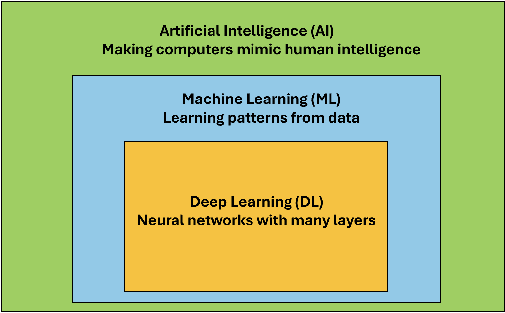
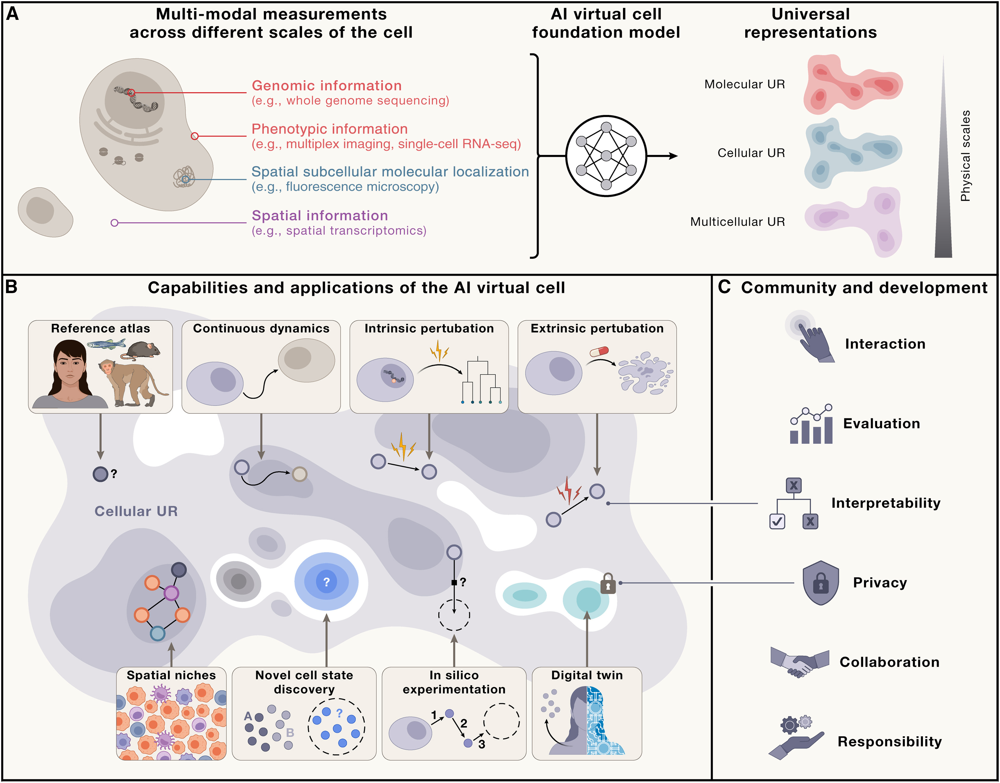

# Chapter 1: Why AI for Genomic Science?

**[Interactive: Chapter 1](https://chaek-union.github.io/ai-for-genomic-science/interactive/chapter1.html)** — Explore the variant hunting problem and see how AI narrows the search.

Dr. Sarah An stares at her computer screen, frustrated. She just received whole-genome sequencing (WGS) data from a 7-year-old patient with a complex rare disorder—severe skeletal abnormalities, neurodevelopmental delays, and metabolic dysfunction. Both parents are healthy, suggesting this is a *de novo* (new) mutation.

The WGS reveals **4.5 million genetic variants** compared to the reference genome. Her computational pipeline identifies approximately **70 de novo variants**—changes found in the patient but not in either parent. These are the prime suspects.

She runs standard pathogenicity prediction tools—CADD scores and PolyPhen-2—to narrow down the list. After filtering, she's left with **3 coding mutations** in genes with unknown function or disease relevance, and **7 noncoding variants** in regulatory regions.

Any of these 10 variants could be causative. But which one?

Each functional validation experiment takes 2–3 months and costs $8,000–15,000. Testing all 10 would take **2+ years** and over **$100,000**. Even then, the noncoding variants are particularly challenging—their effects on gene regulation are subtle and context-dependent, requiring cell-type-specific assays, enhancer reporter experiments, and potentially CRISPR editing in patient-derived cells.

Three days later, using an AI-powered variant prioritization model trained on millions of variants and functional genomics data, Sarah narrows the list to **2 high-confidence candidates**: one coding variant in a gene involved in skeletal development, and one noncoding variant in an enhancer predicted to disrupt a transcription factor expressed in developing bone and neural tissue.

Within two months, functional experiments confirm the noncoding variant as causative—it disrupts an enhancer driving expression of a gene essential for both skeletal and neural development.

This is one example of how we can leverage the power of AI in genomics: not replacing scientific intuition, but dramatically amplifying it to navigate the vast search space of human genetic variation.

---

## Learning Objectives

By the end of this chapter, you will be able to:

- [ ] Describe the data scale problem facing modern genomics and the bottleneck in hypothesis validation
- [ ] Distinguish the conceptual hierarchy of AI, machine learning, and deep learning, and give examples of each
- [ ] Explain the difference between correlation and causation, and discuss why AI cannot establish causation
- [ ] Describe at least three real-world examples where AI has been successfully applied in genomic science
- [ ] Distinguish situations where AI tools should be used appropriately from situations requiring experimental validation

---

## The Biological Challenge

Modern biology faces two unprecedented explosions.

**Data Explosion**: Whole genome sequencing can easily read a single human genome of approximately 3 billion nucleotides, with each person having 3-5 million variants that differ from one another. Single-cell RNA-seq experiments generate data from millions of cells, while various epigenome sequencing techniques can provide information for chromatin accessibility maps across millions of genomic regions. Proteomics technologies can identify hundreds of millions of peptide sequences from a single experiment.

**Many Hypothesis to be explored**: Large-scale genomics studies don't just generate data but they also generate thousands of testable hypotheses. GWAS studies identify hundreds of loci associated with each complex trait, but most are in noncoding regions with unknown mechanisms. Genome sequencing in rare disease cohorts reveals dozens of candidate genes per patient, each requiring functional validation. Cancer genomics finds hundreds of somatic mutations per tumor, but only a subset are "driver" mutations versus neutral "passengers." Single-cell atlases reveal thousands of cell type-specific gene expression patterns, each suggesting regulatory hypotheses. Spatial transcriptomics shows genes co-expressed in tissue neighborhoods, implicating thousands of potential cell-cell interactions.

**Systems-Level Complexity**: The challenge isn't just quantity but the complexity inherent in our cells and tissues. Genes operate in networks, not isolation, and a single phenotype often involves dozens to hundreds of genes working together. Context matters profoundly: the same variant can be benign in one genetic background but pathogenic in another, and gene function depends on cell type, developmental stage, and environmental conditions. Combinatorial interactions add another layer of complexity, where two variants individually benign might be harmful together, causing the number of possible combinations to explode exponentially. Pleiotropic effects further complicate the picture: one gene affects multiple phenotypes while one phenotype is affected by multiple genes, creating a many-to-many mapping rather than a simple one-to-one relationship.

The fundamental problem is that we can generate biological data and hypotheses far faster than we can experimentally test them. A single GWAS might implicate 500 genes, and testing each would take decades. AI helps us predict which experiments to prioritize and which hypotheses are most likely to be true.

---

## The Hierarchy of Artificial Intelligence (AI): From Broad to Specific

**Artificial Intelligence** is the broadest concept—any technique that enables computers to mimic human intelligence. This includes playing chess, recognizing faces, translating languages, predicting protein structures, and classifying cell types.

### Machine Learning (ML)

**Machine Learning** is a subset of AI focused on one question:

> *"Can computers learn patterns from data instead of having humans program every rule explicitly?"*

Think of the difference between a recipe book and a chef who has tasted thousands of dishes. A recipe book follows fixed rules: "if ingredient X, then do step Y." A chef who has tasted enough dishes develops *intuition*—they can sense what's missing without consulting a recipe. Machine learning is closer to the chef: instead of programming every rule, we show the algorithm thousands of examples and let it discover the patterns.

Instead of telling a computer "if the DNA sequence has a TATA box at position -25 and GC content > 60%, it's probably a promoter," we give the computer thousands of labeled examples of promoters and non-promoters, and let it figure out the patterns on its own.

**How a machine learning algorithm learns — an example: predicting variant functional impact**

You have:
- **Input:** Conservation score, population frequency, predicted structural change
- **Output:** Likely functional impact or neutral

The algorithm learns by:

1. **Making initial guesses** (usually random)
2. **Comparing to known answers** (labeled training data)
3. **Measuring how wrong it was** (the "loss")
4. **Adjusting its internal settings** to reduce the error
5. **Repeating thousands of times**

This cycle—guess, compare, adjust, repeat—is how the algorithm "learns" from data, much like how you improve at a skill through practice and feedback.

> **Want to see the math?**
> For a simple model, the algorithm discovers the best *weights* for each input:
> `Score = (Conservation × w₁) + (Frequency × w₂) + (StructuralChange × w₃) + bias`
> The values w₁, w₂, w₃ (and bias) are discovered automatically from thousands of examples—we never specify them. A high w₁ would mean "conservation matters a lot for pathogenicity," while a negative w₂ would mean "common variants are probably benign."

### Deep Learning (DL)

**Deep Learning** uses **artificial neural networks** with many layers to automatically discover patterns in data—think of it as machine learning taken to a much greater depth.

Each layer builds on the previous one, like a series of filters in a microscopy pipeline. The first layer might detect simple sequence motifs such as TATA or CAAT boxes. The second layer combines those motifs to detect larger regulatory modules. The third layer identifies context-dependent regulatory logic. The fourth layer predicts cell-type-specific enhancer activity.

No one programs these layers to look for those patterns—the network discovers them by itself after seeing enough examples. This hierarchical feature learning is what makes deep learning so powerful for genomics.

### The Hierarchy in Practice



**Figure 1.1: The AI Hierarchy - From Broad to Specific.**

**Genomic Tool Examples:**

| Tool | Category | Why? |
|------|----------|------|
| BLAST | AI (not ML) | Uses programmed rules for alignment |
| Random Forest classifier | ML (not DL) | Learns from data, no neural networks |
| AlphaFold | DL | Deep neural networks with many layers |


---

## Correlation vs. Causation: What AI Can and Cannot Tell You

### The Fundamental Limitation

**AI models learn associations (correlations). They do not learn causation.**

This is perhaps the most critical concept for biologists to understand.

### A Concrete Example: Gene Expression and Disease

Suppose you have data showing:
- Gene X expression is highly correlated with Disease Y
- Correlation coefficient r = 0.85, p < 0.001

**What can you conclude?**

❌ **WRONG:** "Gene X causes Disease Y"

❌ **WRONG:** "Targeting Gene X will cure Disease Y"

✓ **CORRECT:** "Gene X expression and Disease Y are associated"

**Why? All four scenarios below produce the *same* correlation, but require completely different interventions:**

| Scenario | What's actually happening | What you should do |
|----------|--------------------------|-------------------|
| Gene X → Disease Y | Gene X directly causes the disease | Target Gene X therapeutically |
| Disease Y → Gene X | The disease itself triggers Gene X expression | Treat the disease, not Gene X |
| Inflammation → Gene X *and* Disease Y | A third factor drives both | Treat inflammation |
| Environmental factor → Gene X *and* Disease Y | Shared cause in the environment | Change the environment |

An AI model trained on correlation data cannot tell you which scenario is true. All four look identical in the data.

> *"The causes of the data cannot be extracted from the data alone."* — Richard McElreath, *Statistical Rethinking*

### Establishing Causation Requires Molecular Experiments

Things to prove causation:

1. Controlled perturbation
   - CRISPR knockout/knockdown: Use CRISPR gene editing to delete or reduce expression of the target gene, then check if the predicted phenotype appears
   - Drug inhibition: Apply a chemical compound that blocks the protein's function, then verify if the phenotype changes as expected
   - Overexpression: Artificially increase the gene's expression level using expression vectors, then observe if this enhances or triggers the predicted phenotype

2. Observation of effect
   - Phenotype changes?: Measure whether the observable characteristic (cell growth, morphology, disease marker) actually changes after perturbation
   - In predicted direction?: Confirm the change matches your hypothesis—if you predicted growth reduction, does growth actually decrease?
   - In the right context?: Verify the effect occurs in the relevant cell type, developmental stage, or environmental condition predicted by your model

3. Mechanism validation
   - How does it work?: Use biochemical assays, imaging, or sequencing to identify the molecular steps—does the gene regulate transcription, bind specific proteins, or alter signaling pathways?
   - Is the pathway what you expected?: Compare the observed molecular mechanism to your predicted pathway—do the right proteins interact, does the right signaling cascade activate?

AI's role: Predict which of 1000 genes to perturb first

Experiments' role: Establish that perturbation actually causes the effect

---

## Drawing the Causal Story: Pathway Diagrams

You already draw causal models in biology—you just call them **pathway diagrams** or **signaling cascades**. The gene regulation pathway below is a perfect example:

```
Transcription Factor (TF)
           ↓
    Enhancer Activity
           ↓
    Gene Expression
           ↓
      Protein Level
           ↓
        Phenotype
```

Each arrow means "causes." This diagram captures something important:
- TF and Protein Level are **correlated** (when TF is active, protein levels tend to be high)
- But TF does **not directly cause** the protein level—it acts through intermediate steps

This distinction matters enormously for experiments. If you want to test whether TF activity causes the phenotype, you need to perturb TF (e.g., with a dominant negative or CRISPR)—not just observe the correlation between TF and phenotype in your RNA-seq data.

Researchers in statistics and computer science call these pathway diagrams **Directed Acyclic Graphs (DAGs)**—a formal name for something biologists have always drawn intuitively.

**The takeaway:** Before interpreting any AI prediction, draw out the causal pathway you believe is operating. This helps you design experiments that test the mechanism, not just the correlation.

---

## Asking the Right Question: Mechanism, Not Just Significance

Most of us learned statistics with one goal: get a p-value below 0.05 and reject the null hypothesis. "Is there an effect?" If yes, move on.

But genomics asks a fundamentally different question: **"Which mechanism explains this phenotype?"**

Consider a GWAS study that finds 200 variants associated with Type 2 diabetes. Rejecting the null hypothesis for each one is easy—we know they have effects. The hard question is: *which of these variants disrupts insulin signaling, and how?* Does it affect a transcription factor binding site? An enhancer? A splice site? These are competing **mechanistic hypotheses**, and no amount of p-value testing can distinguish between them.

> **An analogy:** Imagine your car won't start. A mechanic who only asks "Is there a problem?" (null hypothesis test) isn't very helpful—obviously there's a problem. A good mechanic asks "Is it the battery, the starter motor, or the fuel pump?"—competing hypotheses about mechanism. That's what genomics needs.

**What this means for how you use AI tools:**

When an AI model predicts "this variant is 95% likely to be pathogenic," it's not just saying "effect exists." Based on patterns learned from millions of variants, it's implicitly pointing toward a mechanism. Your job as a scientist is to:

- Ask: *What mechanism is the AI pattern suggesting?* (TF binding disruption? Splicing change? Protein destabilization?)
- Formulate competing mechanistic hypotheses
- Design experiments to distinguish between them

**AI models are most valuable when they help you compare competing biological mechanisms, not just confirm that something is statistically significant.**

---

## Success Stories: AI Transforming Genomics

AI has already made real discoveries across genomics. Here are key examples:

### Protein Structure: AlphaFold (2020-2024)

AlphaFold 2 achieved near-experimental accuracy predicting 3D protein structures in hours instead of months ([Jumper et al 2021, Nature](https://www.nature.com/articles/s41586-021-03819-2)). AlphaFold 3 extended to protein complexes and DNA/RNA interactions ([Abramson et al 2024, Nature](https://www.nature.com/articles/s41586-024-07487-w)). Over 200 million structures are now freely available, accelerating drug discovery and disease research.

### Variant Calling and Interpretation (2015-present)

DeepVariant treats sequencing as image recognition, reducing error rates by 50% vs. traditional methods ([Poplin et al 2018, Nature Biotechnology](https://www.nature.com/articles/nbt.4235)). Now standard in clinical sequencing. Models like DeepSEA and Basenji extended this to predict regulatory variant effects ([Zhou & Troyanskaya 2015, Nature Methods](https://www.nature.com/articles/nmeth.3547); [Kelley et al 2018, Genome Research](https://genome.cshlp.org/content/28/5/739)). Transformer models predict gene expression, chromatin state, and histone modifications from DNA sequence alone ([Avsec et al 2021, Nature Methods](https://www.nature.com/articles/s41592-021-01252-x)). This enables predicting noncoding variant effects and revealing long-range regulatory interactions up to 100kb away.

### Single-Cell Analysis: Foundation Models (2022-2024)

Models like scGPT and Geneformer treat genes as words in language, learning universal cellular representations ([Cui et al 2024, Nature Methods](https://www.nature.com/articles/s41592-024-02201-0); [Theodoris et al 2023, Nature](https://www.nature.com/articles/s41586-023-06139-9)). This enabled the Human Cell Atlas and reduced cell type annotation from weeks to hours.

### Drug Discovery: Virtual Screening (2020-present)

Deep learning screens 100+ million molecules virtually in days. Halicin—a novel antibiotic effective against drug-resistant bacteria—was discovered this way ([Stokes et al 2020, Cell](https://doi.org/10.1016/j.cell.2020.01.021)). A major regulatory milestone came in 2024 when the FDA accepted Recursion Pharmaceuticals' AI-based models as a replacement for animal testing in certain toxicology studies. This represents the first time AI predictions were formally approved to substitute traditional animal experiments in drug development, potentially accelerating timelines while reducing costs and ethical concerns.

### Common Success Patterns

These breakthroughs share key features:
- **Massive datasets** for training
- **Clear, measurable goals**
- **Too expensive/slow** for comprehensive experimental testing
- **Complex patterns** difficult to program explicitly
- **Predictions guide** rather than replace experiments
- **Rigorous experimental validation** of key predictions

---

## The Paradigm Shift: How AI Changes Biology

Perhaps the most profound change AI brings isn't speed or scale—it's a fundamental transformation in how we do science.

### From Linear to Iterative Discovery

**Traditional: Hypothesis-Driven Research**

```
Observe → Hypothesis → Experiment → Data → Accept/Reject → New Hypothesis
```

Limitations: One hypothesis at a time, months to years per cycle, testing only what we suspect.

**New: AI-Augmented Discovery Loop**

```
Large-scale data → AI training → Thousands of predictions
         ↑                                  ↓
    New data ← Selective validation ← Prioritize by confidence
```

From sequential testing to parallel exploration. AI generates thousands of hypotheses simultaneously, experiments validate the most promising ones, results improve the model, and the cycle accelerates.

### The Virtual Cell Vision

Recent work envisions **AI Virtual Cells (AIVC)**—comprehensive computational models simulating cellular behavior across molecular, cellular, and tissue scales ([Bunne et al 2024, Cell](https://doi.org/10.1016/j.cell.2024.11.015)).



**Figure: Capabilities of the AI Virtual Cell**. *The AIVC provides universal representations (UR) of cell states that can be obtained across species and conditions from different data modalities (A). These representations enable predicting cell biology, modeling dynamics, and performing in silico experiments (B). The utility depends on interactions at individual, community, and societal levels—requiring accessibility, interpretability, evaluation frameworks, privacy protection, and collaborative development (C). Source: [Bunne et al 2024, Cell](https://doi.org/10.1016/j.cell.2024.11.015). License: CC-BY 4.0.*

This enables **in silico experimentation**:
1. Simulate experiment computationally
2. Predict outcome with confidence intervals
3. Only test physically the most promising/uncertain predictions

**Drug screening example:**

| Approach | Compounds | Cost | Time | Hits |
|----------|-----------|------|------|------|
| Traditional | 10,000 physical | $50M | 2 years | 5-10 |
| AI-augmented | 100M virtual → 1,000 physical | $5M | 6 months | 20-30 |

### Active Learning: Scientists in the Loop

The most powerful approach combines AI prediction with human expertise:

```
Scientist's Question → Virtual Cell Simulation →
  Scientist Reviews + Domain Knowledge → 
    Lab Experiments → Virtual Cell Learns → (Loop continues)
```

AI amplifies—doesn't replace—biological expertise. Scientists still ask questions, interpret meaning, decide what to test, and validate results. But now they can explore vastly larger hypothesis spaces.

---

## What Biologists Need to Know About AI

### Practical Skill Levels

| Level | Who | What You Can Do | Time Investment |
|-------|-----|-----------------|-----------------|
| **Consumer** | All biologists | Use existing AI tools (AlphaFold, CADD scores)<br>Interpret predictions critically<br>Understand limitations and when to validate<br>Recognize biases | Hours (this course) |
| **User** | Data-oriented | Run pre-trained models on your data<br>Perform data preprocessing and visualization<br>Integrate AI into analysis pipelines | Weeks of practice |
| **Developer** | Computational biology | Fine-tune and train new models<br>Develop novel architectures<br>Collaborate as equal partner with ML researchers | Months to years |

**This textbook targets Levels 1-2.**

### When to Use AI

| Use AI When: | Don't Use AI When: |
|--------------|-------------------|
| Large datasets (1000+ examples) | Very little data (<100 examples) |
| Complex patterns (many variables) | Mechanism understanding is critical |
| Expensive/slow experiments | Very high stakes without validation |
| Need for scale (millions of predictions) | Problem is simple (basic statistics work) |
| Similar problems solved (transfer learning) | Training data doesn't match your population |

**Decision Framework:**

```
Need to prioritize/predict many things?
  NO → Traditional experiments
  YES → Have >1000 training examples?
    NO → Use statistics or small ML models
    YES → Pattern too complex for simple rules?
      NO → Try simple models first (linear, random forest)
      YES → Consider deep learning
           ↓
      Always validate key predictions experimentally!
```

### Common AI Failures and Lessons

| Failure Type | Example | What Went Wrong | Lesson |
|--------------|---------|-----------------|--------|
| **Overfitting** | Sepsis prediction: 80% accuracy in training, random chance in real hospitals | Learned when nurses check vitals, not sepsis biology | Validate on truly independent data from different sources |
| **Unnecessary Complexity** | Deep learning 85% vs. simple linear 87% accuracy | Problem was actually linear; complexity hurt performance | Start simple, only add complexity when needed |
| **Population Bias** | 30% more variants flagged as "pathogenic" in African genomes | Training data >80% European ancestry; novelty interpreted as pathogenicity | Ensure training data represents application population |
| **Confounding** | Gene X "causes" disease | Actually: Disease → Inflammation → Gene X | Draw causal models; design experiments to test |

---

## Summary

**Key Takeaways:**

1. **Biology's data explosion** outpaces experimental validation—AI helps prioritize what to test
2. **AI ⊃ ML ⊃ DL** - Hierarchy from broad to specific, each with distinct use cases
3. **Learning = optimization** - Algorithms discover patterns by adjusting parameters to minimize errors
4. **Correlation ≠ Causation** - AI finds associations; experiments establish causation through controlled perturbation
5. **Ask "which mechanism?" not "is there an effect?"** - Compare competing biological hypotheses rather than just testing "no effect"
6. **Pathway diagrams are causal models** - The signaling cascades you already draw help distinguish direct causation from indirect correlation
7. **Proven impact** - AlphaFold, DeepVariant, single-cell analysis, drug discovery all transform research
8. **Paradigm shift** - From linear hypothesis-testing to iterative AI-augmented discovery loops
9. **Virtual cells and in silico experimentation** - AIVC enables computational simulation before physical testing
10. **Human expertise essential** - AI amplifies biological insight rather than replacing it
11. **Strategic application** - Use for large datasets, complex patterns, expensive experiments; avoid for small data, causal mechanisms, simple problems
12. **Critical evaluation needed** - Beware overfitting, bias, generalization failure, reproducibility issues

---

<details>
<summary><strong>📖 Key Terms</strong></summary>

| Term | Definition |
|------|-----------|
| **Artificial Intelligence (AI)** | Field of making computers perform tasks requiring human intelligence |
| **Machine Learning (ML)** | Algorithms that learn patterns from data without explicit programming |
| **Deep Learning (DL)** | ML using multi-layered neural networks |
| **Causal Inference** | Methods for establishing causation, not just correlation |
| **DAG (Directed Acyclic Graph)** | A formal name for the pathway diagrams biologists already draw—arrows indicate cause-and-effect, and no circular loops are allowed |
| **Parameters** | Numerical values a model learns to make predictions |
| **Training Data** | Examples with known answers used to teach models |
| **Optimization** | Adjusting parameters to minimize prediction errors |
| **Overfitting** | Learning training data too well, failing on new data |
| **Bias** | Systematic errors from unrepresentative training data |
| **Confounding** | When a third variable creates spurious associations |
| **Foundation Model** | Large-scale models trained on diverse data, transferable to many tasks |
| **AI Virtual Cell (AIVC)** | Computational model simulating cellular behavior across scales |
| **Active Learning** | Iterative process where AI identifies most informative next experiments |
| **CRISPR knockout/knockdown** | Gene editing to delete or reduce gene expression for causal validation |
| **Drug inhibition** | Chemical compounds blocking protein function to test causation |
| **Overexpression** | Artificially increasing gene expression levels to observe phenotypic effects |

</details>

---

## Test Your Understanding: Can You Answer These?

<details>
<summary><strong>1. What is the difference between AI, ML, and DL?</strong></summary>

**Answer:**

- **AI (Artificial Intelligence)** is the broadest concept—any technique that enables computers to mimic human intelligence (e.g., BLAST for sequence alignment uses programmed rules)
- **ML (Machine Learning)** is a subset of AI where algorithms learn patterns from data without explicit programming (e.g., Random Forest classifier learns to predict variant pathogenicity from training examples)
- **DL (Deep Learning)** is a subset of ML that uses multi-layered neural networks to automatically discover hierarchical patterns (e.g., AlphaFold uses deep neural networks with many layers to predict protein structure)

**Example:** BLAST is AI but not ML (uses rules). A Random Forest variant classifier is ML but not DL (no neural networks). AlphaFold is DL (deep neural networks).

</details>

<details>
<summary><strong>2. Why can't AI alone determine if a gene causes a disease?</strong></summary>

**Answer:**

AI can only find **correlations** (patterns that occur together), not **causation** (one thing directly causing another).

**Example:** If Gene X expression correlates with Disease Y, there are multiple possible explanations:
- Gene X directly causes Disease Y
- Disease Y causes Gene X expression to change
- A third factor (e.g., inflammation) causes both Gene X expression and Disease Y

AI cannot distinguish between these scenarios. Only **controlled experiments** (like CRISPR knockout, drug inhibition, or overexpression) can establish causation by directly perturbing the gene and observing if the disease phenotype changes.

</details>

<details>
<summary><strong>3. When should you use AI versus simple experiments?</strong></summary>

**Answer:**

**Use AI when:**
- You have large datasets (thousands of samples)
- You need to prioritize among many possibilities (e.g., which of 1 million variants to study?)
- Experiments are expensive or time-consuming
- You're looking for complex patterns humans might miss

**Use simple experiments or statistics when:**
- You have small datasets (fewer than 100 samples)
- You're testing a specific mechanistic hypothesis
- The question is straightforward (e.g., comparing expression of 10 genes between two conditions)
- You need to establish causation, not just correlation

**Key principle:** AI helps you decide *what* to test experimentally, but experiments prove *why* something happens.

</details>

---


