# Chapter 2: From Biological Intuition to Deep Learning

You're in your room, and there's a small globe-shaped ball sitting on your desk—one of those foam stress balls shaped like Earth. Out of boredom between problem sets, you toss it in the air and catch it with your eyes closed. Your right index finger lands on... **water**. You try again. **Water**. Again. **Land**. After 9 tosses, you've recorded: **W L W W W L W L W** (6 water, 3 land).

*"So Earth is about 67% water?"* you think.

But wait—are you *certain*? What if you just got lucky? What if the true proportion is actually 70%, and you happened to get 6 out of 9 by chance? Or maybe it's 60%? You decide to keep going. After 100 tosses, you have: **71 water, 29 land**. Now you're more confident: *"Okay, probably around 71% water."*

**What just happened in your brain?**

You started with complete uncertainty. Each toss gave you evidence. You continuously updated your belief about Earth's water proportion. By the 100th toss, you had a much sharper, more confident estimate.

**This is Bayesian reasoning**—and you do it every day without realizing it:
- Troubleshooting failed PCRs
- Deciding if a gene expression change is real or noise
- Evaluating whether a called variant is real or a sequencing error
- Interpreting your professor's claim that "this exam will be easy"

Your brain is already a sophisticated Bayesian inference machine. This chapter will show you that:
1. **You already think probabilistically** (you just didn't have the vocabulary)
2. **Biology itself operates on probability distributions** (not fixed values)
3. **Deep learning formalizes this intuition** at massive scale

By understanding this connection, neural networks will transform from mysterious black boxes into intuitive tools that amplify what you already do naturally.

---

## Your Brain Already Does Bayesian Inference

### You're a Natural Statistician

Every moment, your brain makes predictions and updates beliefs. Let's see this in action.

#### Example 1: "Mom Said I'd Lose Weight in College!"

**Before starting university (Prior belief):**

Your mom confidently told you: *"Don't worry about the tuition—you'll lose weight in college! Students are always busy, walking everywhere, no time to eat much."*

```
Your initial belief:
• Probability of losing weight: 65%
• Reasoning: Busy schedule, independent living, more exercise
```

**First semester reality (New evidence):**

You're a student at Korea University. The actual data you observe:

```
Weekly schedule includes:
• Central Plaza (중앙광장): Makgeolli (막걸리, rice wine) gatherings 2x/week
• Daedongje (대동제, university festival): 3 days of continuous eating and drinking
• Goyeonjeon (고연전, Korea-Yonsei rivalry game): Epic celebration with traditional Korean food and drinks
• Late-night 치맥 (chimaek = chicken + beer): Every time you finish an exam
• Convenience store ramyeon: 1 AM study fuel
```

**End of first semester (Posterior belief):**

```
Actual outcome: Gained 7 kg

Updated beliefs:
• Probability of losing weight: 5% ← Dramatically decreased!
• Probability of gaining weight: 85% ← Reality hit hard
• Mom's prediction accuracy: 10% ← Love you mom, but...
```

**What happened here?**

You performed Bayesian inference:
1. **Prior:** Mom's belief that college = weight loss (65% confident)
2. **Evidence:** Actual data from Central Plaza, Daedongje, Goyeonjeon showed high-calorie social culture
3. **Likelihood:** This evidence strongly contradicts the prior belief
4. **Posterior:** Updated to 85% confident that college = weight GAIN

**The math you didn't know you were doing:**

```
Updated Belief (Posterior) ∝ How well hypothesis explains evidence (Likelihood) 
                             × What you believed before (Prior)

P(weight loss | college life data) = Very low!
P(weight gain | college life data) = Very high!
```

The evidence (막걸리🍶 at Central Plaza, festival food, late-night 치맥🍻🍗) completely overwhelmed your prior belief. This is Bayesian updating in action—when strong evidence contradicts your prior, you update your beliefs accordingly!😄

Your brain did this automatically. You didn't consciously calculate probabilities, but you naturally weighted the evidence (all those makgeolli nights) against your prior belief (mom's prediction) and reached a new conclusion.

#### Example 2: "This Exam Will Be Easy"

**Two weeks before the exam:** Your professor announces, "Don't worry everyone, this exam will be easy!"

**Your automatic Bayesian reasoning:**

```
Prior beliefs about exam difficulty:
Based on past exams from this professor:
• Last 3 exams: Average score was 68%, 71%, 65%
• Students always complain exams are hard
• Professor has said "easy" before... but wasn't

Initial belief: "Probably still going to be hard" → 70% confident it's hard

Evidence: Professor said "easy"
Likelihood: How often does "professor says easy" actually mean easy?
  Based on past experience: 20% of the time
  
Updated belief (Posterior):
"Still probably hard, but maybe slightly easier?" → 55% confident it's hard
```

**After the exam:** It was actually easy! Average score: 87%

**Your brain updates again for next time:**

```
New posterior becomes your next prior!

Next time professor says "easy":
Prior: 45% confident it's hard (down from 70%)
"Okay, maybe I should trust them more now"
```

This is Bayesian learning from experience! Each outcome updates your beliefs for future predictions.

#### Example 3: Is This Gene Differentially Expressed?

You're analyzing RNA-seq data. Gene X shows:
- Control: mean = 45.3 TPM (n=3 biological replicates)
- Treatment: mean = 52.1 TPM (n=3 replicates)
- p-value = 0.048

**Your automatic Bayesian reasoning:**

```
Question: "Is this change real or just noise?"

What you consider (even if unconsciously):
• Fold-change: 52.1/45.3 = 1.15 → small, modest evidence
• P-value: 0.048 → barely crosses 0.05 threshold
• Sample size: Only n=3 → high uncertainty
• Biology: Gene X is in a pathway known to respond to this treatment → increases plausibility
• Effect size: Absolute difference only 6.8 TPM → biologically meaningful?

Your conclusion: "Probably real, but I should validate with qRT-PCR"
                 → ~65% confidence it's a true change
```

**Notice what you did:**
- Combined multiple pieces of evidence
- Weighted each piece differently (biological knowledge matters!)
- Didn't just rely on p-value
- Expressed uncertainty (not "yes/no" but "probably")

**This is Bayesian thinking!**

You integrated:
- **Prior:** Knowledge about the pathway (increases belief in real change)
- **Likelihood:** Statistical evidence (fold-change, p-value, n)
- **Posterior:** Updated belief incorporating everything (~65% confident)

#### Example 4: Is This Called Variant Real?

You're reviewing whole-genome sequencing data. The variant caller identified a SNP at position chr7:55,242,466:

```
Reference: A
Called variant: G
Read support: 8 reads with G, 2 reads with A
Total depth: 10 reads
Base quality scores: mostly Q30+ (high confidence)
```

**Your brain's automatic Bayesian analysis:**

```
Starting belief (Prior):
• Most positions match reference: 99.9%
• True variant rate: ~0.1% per position

Evidence observed:
+ 8/10 reads support the variant
+ High base quality (Q30+)
- BUT: Only 10× depth (somewhat low)
- Position is in a repetitive region (increases error likelihood)

Two competing hypotheses:

H1: Real heterozygous variant (A/G genotype)
  Expected read distribution: ~50% A, ~50% G
  Observed: 20% A, 80% G → doesn't match perfectly, but sampling variation?
  
H2: Sequencing error (true genotype A/A)
  Expected: All A reads, but some errors
  Error rate in this region: ~2%
  Observed: 80% errors seems too high for random errors...

Updated belief (Posterior):
"Probably real, but confidence is moderate" → ~70% confident
"Should check in validation dataset or with different sequencing platform"
```

**What happens with more evidence?**

```
Additional evidence: You check gnomAD database
• This exact variant seen in 15/280,000 people (allele frequency ~ 0.00005)
• Found in multiple populations
• No evidence of being a common sequencing artifact

Updated posterior:
"Very likely real" → 95% confident

This is exactly what tools like DeepVariant do—but at genome-wide scale!
```

**Key insight:** 

Variant calling is fundamentally a Bayesian problem:
- **Prior:** Most positions match reference, true variants are rare
- **Likelihood:** What's the probability of seeing this read pattern if it's real vs. error?
- **Posterior:** Confidence that variant is real

Deep learning tools like DeepVariant learn to compute these posteriors automatically from millions of examples!

### The Bayesian Formula (Don't Panic!)

You've been doing this intuitively. Here's the formal version:

```
Posterior ∝ Likelihood × Prior

P(Hypothesis | Data) ∝ P(Data | Hypothesis) × P(Hypothesis)
      ↑                        ↑                    ↑
  What you believe        How well this          What you believed
  AFTER seeing data    hypothesis explains      BEFORE seeing data
                        what you observed
```

**In plain English:**

> **Your updated belief about something = (How well it explains what you observed) × (What you thought before observing)**

**Real examples from your life:**

| Situation | Prior | Likelihood | Posterior |
|-----------|-------|------------|-----------|
| College weight | Mom says you'll lose weight (65%) | Central Plaza 막걸리, 대동제, 고연전 치맥 | Actually gained weight (85%) |
| Professor says "easy exam" | Past exams were hard (70%) | Prof said "easy" but was wrong before | Still probably hard (55%) |
| Gene expression | Pathway expected to respond (60%) | Small fold-change, p=0.048 | Moderately confident (65%) |
| Called variant | Most positions match reference (99.9%) | 8/10 reads + seen in gnomAD | Likely real (95%) |

**The beautiful part:** Your brain weights evidence automatically. Strong evidence (makgeolli nights at Central Plaza, variant in gnomAD database) can overwhelm an optimistic or pessimistic prior. Weak evidence (professor says "easy") barely moves your belief.

---

## Biology Is Fundamentally Probabilistic

Here's a profound insight that will change how you think about biology. Biology doesn't operate with fixed values. It operates with probability distributions.

### What Does This Mean?

**Common misconception:** "Gene X is expressed at 47.3 TPM"

**Reality:** Gene X's expression is a *probability distribution* across cells, time, and conditions.

Let's see why.

### Example 1: Gene Expression is a Distribution, Not a Number

Imagine you do single-cell RNA-seq on "identical" T cells from the same person, same tissue, same moment. You measure IL2 (interleukin-2) expression:

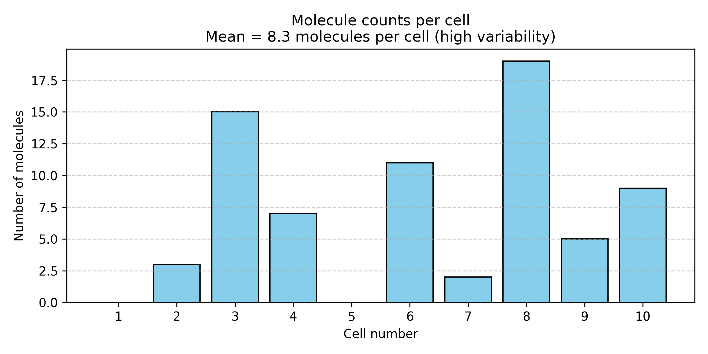

**Figure: IL2 expression varies dramatically across individual cells**. *Single-cell measurements of IL2 (interleukin-2) mRNA molecules in 10 "identical" T cells from the same sample. Despite being genetically identical cells in the same condition, expression ranges from 2 to 19 molecules per cell, with a mean of 8.3. This huge variability (coefficient of variation ~70%) is not measurement error—it's biological reality driven by stochastic transcription.*

**Why does this happen?**

Gene expression is fundamentally **stochastic** (random):
- Transcription factors bind and unbind randomly
- RNA polymerase initiation is probabilistic—sometimes it starts, sometimes it doesn't
- mRNA molecules degrade at random times
- Cells are in different cell cycle phases
- Local microenvironment varies slightly between cells

**This variability isn't measurement error—it's biological reality!**

The "true" expression of IL2 isn't a single number. It's a **probability distribution**:

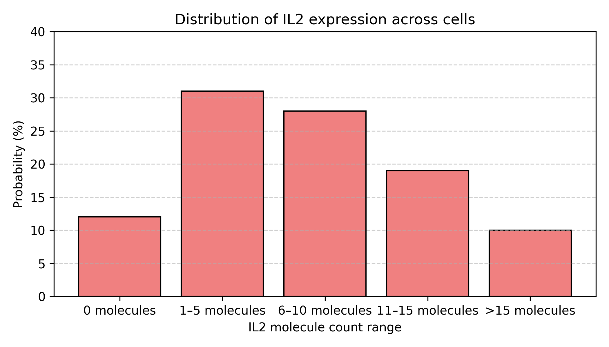

**Figure: IL2 expression as a probability distribution**. *The same data shown as a probability distribution rather than individual cell measurements. Most cells (31%) express 1-5 molecules, but there's substantial spread: 12% express nothing, while 10% express more than 15 molecules. This distribution shape—not just the mean—is the biological reality.*

**Implications:**

When we say "IL2 is expressed at 8.3 TPM," we're really reporting the **center of a distribution**, not a fixed truth. The full story requires the entire distribution—mean, variance, shape.

**This matters for AI/ML:** Deep learning models should predict distributions, not just point estimates!

### Example 2: Protein Folding is an Ensemble, Not a Structure

**What you learned in biochemistry:** "Protein X folds into structure Y"

**What actually happens:** Protein X samples a *statistical ensemble* of conformations:

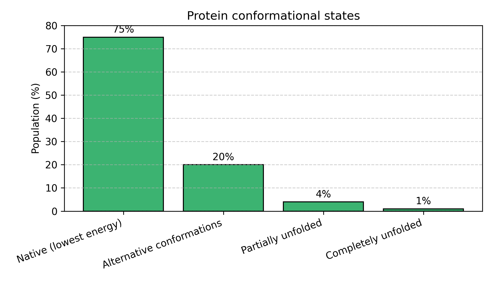

**Figure: Proteins exist as an ensemble of conformational states**. *Rather than adopting a single rigid structure, proteins constantly fluctuate between different conformations. The native state (lowest energy) is most probable (75%), but the protein regularly visits alternative conformations (20%), partially unfolded states (4%), and rarely completely unfolds (1%). This distribution changes with temperature, pH, mutations, and binding partners.*

The protein constantly fluctuates! It:
- Spends most time in the native state (most stable)
- Occasionally visits alternative conformations
- Rarely unfolds completely
- The distribution changes with temperature, pH, mutations, binding partners

**AlphaFold doesn't predict "the" structure**—it predicts the **most probable** structure (the peak of the distribution). The pLDDT score tells you how confident AlphaFold is, which relates to how sharp that distribution is.

```
High pLDDT (>90): Sharp peak → protein is rigid, well-defined structure
Low pLDDT (<50): Flat distribution → protein is flexible, intrinsically disordered
```

### Example 3: Evolution is Bayesian Updating Over Generations

Evolution literally performs Bayesian inference at the population level!

**Before environmental change (Prior distribution):**

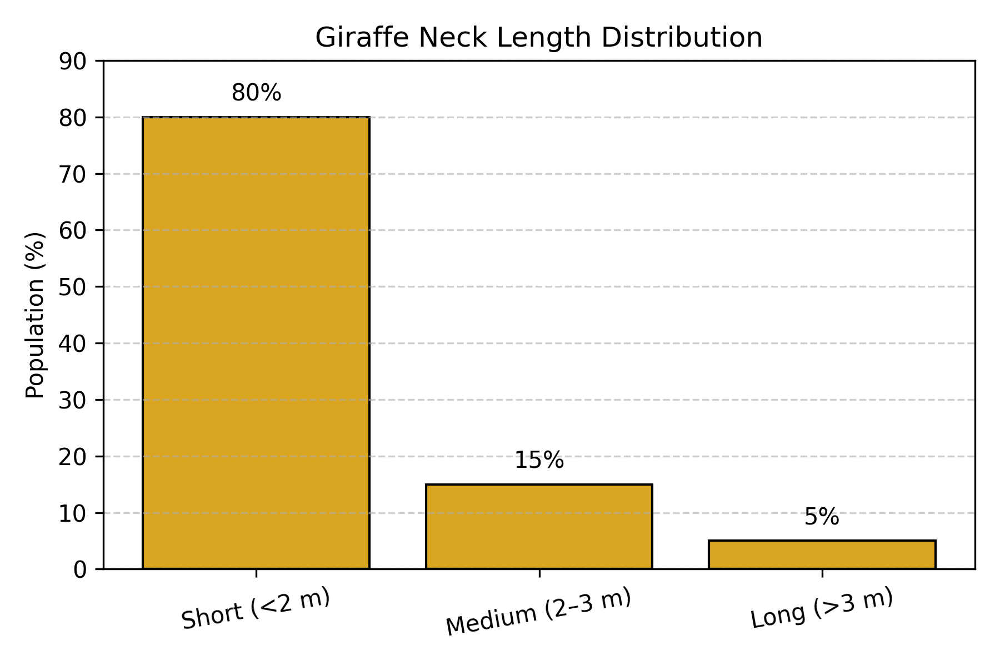

**Figure: Giraffe neck length distribution before environmental change**. *In the ancestral giraffe population, most individuals (80%) had short necks (<2m), with progressively fewer having medium (15%) or long (5%) necks. This represents the "prior" distribution before selection pressure.*

**Environmental change occurs:** Climate shifts, tall trees become dominant food source.

**Survival rates (Likelihood):**

```
P(survive to reproduce | short neck) = 8%   ← Can't reach food
P(survive to reproduce | medium neck) = 35% ← Can reach some food
P(survive to reproduce | long neck) = 72%  ← Can reach most food
```

**After several generations (Posterior distribution):**

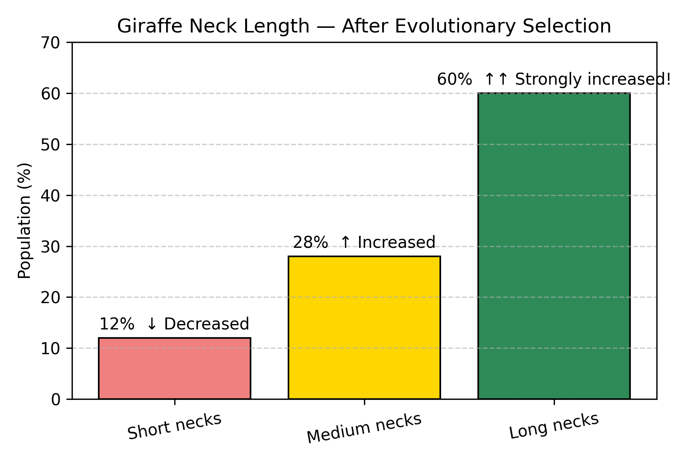

**Figure: Giraffe neck length distribution after natural selection**. *After multiple generations of selection for tall tree feeding, the distribution has dramatically shifted. Long necks increased from 5% to 60% (12× increase!), medium necks doubled from 15% to 28%, while short necks decreased from 80% to 12%. This is Bayesian updating in action: the population "learned" which trait is adaptive based on survival data.*

**This is Bayesian updating!**

```
P(long neck | survival) ∝ P(survival | long neck) × P(long neck)
       ↑                         ↑                      ↑
  New frequency              Fitness advantage      Old frequency
   (Posterior)                 (Likelihood)           (Prior)
```

Evolution updates the population distribution based on environmental "evidence"! Natural selection is nature's way of performing Bayesian inference. Populations "learn" which traits are adaptive through survival data.

### Example 4: Your Immune System Learns Like a Bayesian

Your immune system is a beautiful example of Bayesian learning in action.

**First exposure to pathogen (Prior):**

```
Your immune system has never seen this virus.

Antibody repertoire: Millions of random antibodies
Success rate: ~0.01% of antibodies can bind this pathogen
```

**During infection (Observing data):**

```
B cells produce antibodies and test them:
• Antibody A tries to bind virus → FAIL → B cell dies
• Antibody B tries to bind virus → FAIL → B cell dies
• Antibody C tries to bind virus → SUCCESS! → B cell survives & multiplies
• Antibody D tries to bind virus → SUCCESS! → B cell survives & multiplies
...

Evidence accumulates: "These specific antibodies work against the pathogen!"
```

**After infection (Posterior = Immunological memory):**

```
Memory B cells: Enriched for successful antibodies
Success rate: ~80% of memory B cells produce effective antibodies

Your immune system "learned" from data!
Improvement: 0.01% → 80% (8,000× better!)
```

**Upon re-infection:**

```
Prior = Posterior from last time
→ Rapid, effective response because you "remember" which antibodies work

This is why vaccines work!
```

**The Bayesian interpretation:**

1. **Prior:** Broad distribution of random antibodies (uniform prior)
2. **Likelihood:** Which antibodies successfully bind pathogen (data)
3. **Posterior:** Enriched distribution favoring effective antibodies (learned)
4. **Next infection:** Start with this posterior as new prior (memory)

### The Pattern: Biology = Probability Distributions

Notice the theme?

| Phenomenon | Not "The Value" | But "The Distribution" |
|------------|----------------|------------------------|
| Gene expression | "Gene X = 50 TPM" | P(expression &#124; cell, state, time) |
| Protein structure | "Folds to structure S" | P(conformation &#124; sequence, environment) |
| Evolution | "Giraffes have long necks" | P(trait &#124; environment, time) |
| Immune response | "Antibody Y fights virus Z" | P(antibody effective &#124; pathogen, history) |
| Genetic penetrance | "Mutation causes disease" | P(disease &#124; genotype, background, environment) |
| Transcription | "Gene is ON" | P(transcription event &#124; TF levels, chromatin state) |

**Profound implication:** When we do biology, we're not discovering fixed truths—we're characterizing probability distributions over biological states!

**Why this matters for AI:**

Modern AI tools should:
- Output distributions, not just point estimates
- Quantify uncertainty
- Update beliefs as new evidence arrives

Understanding this probabilistic foundation helps you use and interpret AI tools correctly!

---

## The Globe-Tossing Experiment: Learning from Data

Now let's formalize these intuitions with a beautiful example from Richard McElreath's *Statistical Rethinking*.

### The Setup

Back to your room with that globe-shaped ball.

You've never actually checked what proportion of Earth is water. Time to find out!

**Your method:**
1. Toss the ball in the air
2. Catch it with your eyes closed
3. Note what's under your right index finger: **Water (W)** or **Land (L)**
4. Repeat many times

**First 9 tosses:** W L W W W L W L W

**Data summary:** 6 Water, 3 Land

**Question:** What proportion of Earth is water?

### The Naïve Answer

*"I got water 6 out of 9 times, so Earth must be 6/9 = 67% water!"*

**But wait—are you certain?**

- What if the true proportion is 70%, and you just happened to get 6 W's by chance?
- What if it's 60%, and you got slightly lucky?
- With only 9 tosses, there's substantial uncertainty!

**Bayesian approach:** Express belief as a **probability distribution** over all possible proportions, not a single number!

### Considering Different Hypotheses

Let's evaluate several candidate hypotheses:

```
H₁: p = 0.00 (0% water - all land)
H₂: p = 0.25 (25% water)
H₃: p = 0.50 (50% water)
H₄: p = 0.75 (75% water)
H₅: p = 1.00 (100% water - all ocean)
```

### Before Any Data: The Prior

You've never checked before. You have no idea what to expect.

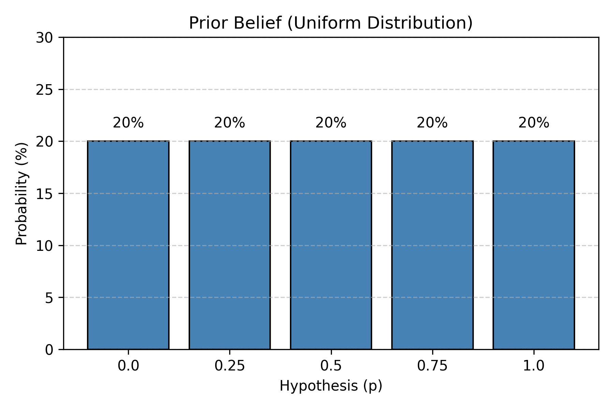

**Figure: Uniform prior distribution**. *Before observing any data, all hypotheses are equally plausible. Each of the five water proportions (0%, 25%, 50%, 75%, 100%) has equal 20% probability. This represents complete uncertainty—we have no reason to favor one hypothesis over another.*

This is called a **uniform prior**—no hypothesis is favored initially.

### After Seeing Data: The Likelihood

Now comes the clever part. We ask:

**"For each hypothesis, how likely would we observe 6 W and 3 L?"**

This is the **likelihood**: P(data | hypothesis)

#### Understanding Likelihood Through the "Garden of Forking Paths"

This is Richard McElreath's brilliant intuitive explanation!

Imagine each hypothesis as a bag of marbles:
- **Blue marbles** = water
- **White marbles** = land

**For p = 0.50 (bag has 1 blue, 1 white marble):**

```
Toss 1: W
  Ways to get W: 1 (pick the blue marble)
  Paths so far: 1

Toss 2: L
  For each previous path, ways to get L: 1 (pick white marble)
  Paths so far: 1 × 1 = 1

Toss 3: W
  Ways to get W: 1
  Paths so far: 1 × 1 = 1

Continue for all 9 tosses (6 W's and 3 L's)...

Total paths: 1^6 × 1^3 = 1
```

**For p = 0.75 (bag has 3 blue, 1 white marble):**

```
Each W: 3 ways (pick any of 3 blue marbles)
Each L: 1 way (pick the 1 white marble)

Total paths: 3^6 × 1^3 = 729 paths!
```

**For p = 0.25 (bag has 1 blue, 3 white marbles):**

```
Each W: 1 way
Each L: 3 ways

Total paths: 1^6 × 3^3 = 27 paths
```

**For p = 0.00 or p = 1.00:**

```
Can't produce both W and L from these bags
Paths = 0
```

**The key insight:**

**Likelihood = Number of ways this hypothesis could produce your observed data**

More paths = more plausible!

### Calculating the Posterior

Now we combine prior and likelihood using the Bayesian formula:

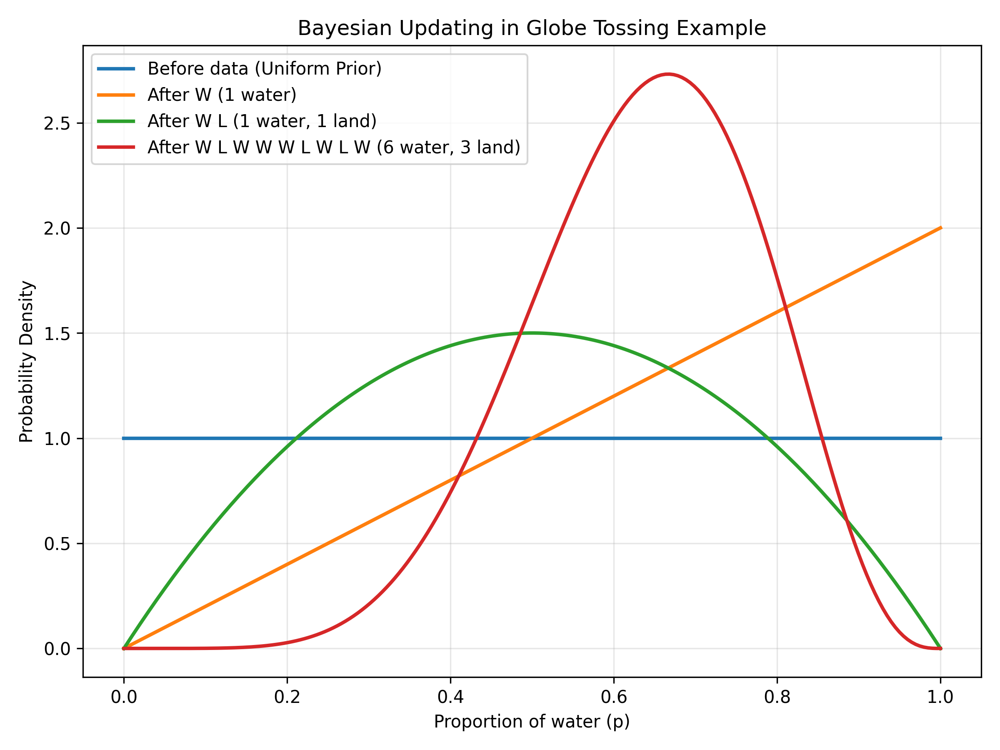

**Figure: Final posterior probabilities after 9 tosses**. *After multiplying likelihood (paths) by prior and normalizing, we get the posterior distribution. The data (6W, 3L) provides overwhelming evidence for p=0.75, which receives 97.6% of the probability mass. The hypothesis p=0.25 gets only 2.3%, and p=0.50 is nearly ruled out at 0.1%. The extreme values (p=0 and p=1.0) are impossible since we observed both water and land.*

**Result:** After seeing 6 W and 3 L:
- 97.6% confidence that p ≈ 0.75
- 2.3% confidence that p ≈ 0.25
- Other values essentially ruled out

### Visualizing Bayesian Updating

Let's see how beliefs evolve with each toss:

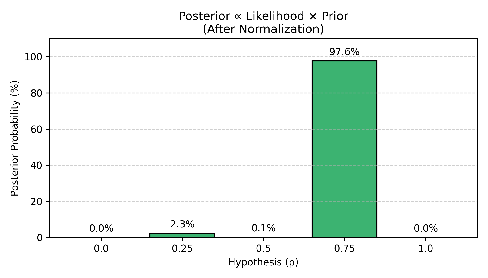

**Figure: Sequential Bayesian updating with each observation**. *Starting from a flat uniform prior (blue line), each observation shifts and sharpens the distribution. After the first water (W, orange line), belief shifts toward higher p values. After one water and one land (W L, green line), the distribution centers around p=0.5. After all 9 tosses with 6 waters and 3 lands (red line), the distribution forms a sharp peak around p=0.67. Notice how each piece of evidence updates the previous belief, and more data leads to stronger confidence (narrower distribution).*

**Key observations:**

1. **Each toss updates beliefs** - the distribution shifts and sharpens
2. **More data = more confidence** - the peak gets narrower
3. **Evidence accumulates** - early random fluctuations smooth out
4. **Never 100% certain** - there's always some uncertainty (the distribution has width)

### The Power of More Data

Let's continue tossing!

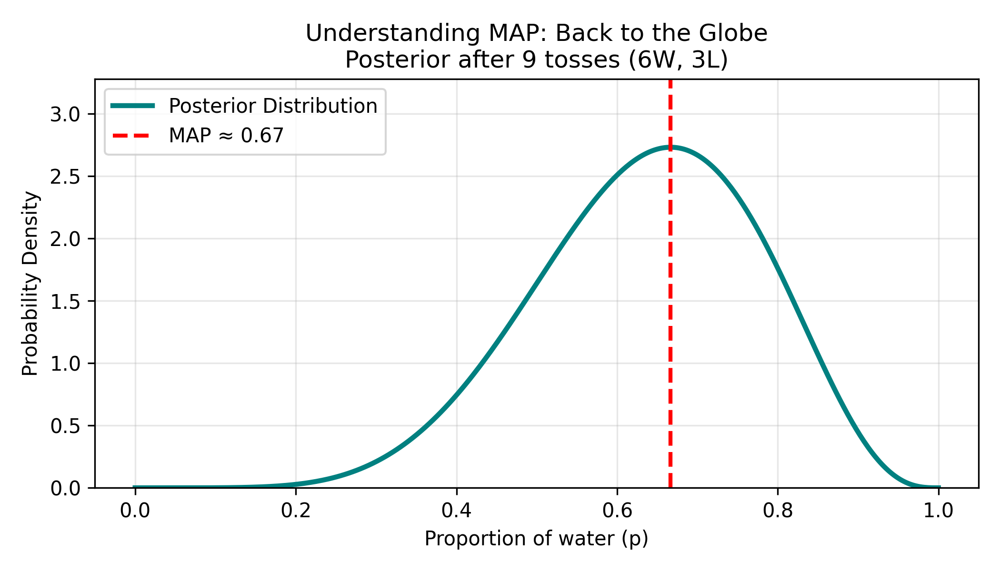

**Figure: Posterior distribution sharpens dramatically with more data**. *After 100 tosses (71W, 29L), the posterior distribution becomes much narrower and taller. The MAP estimate shifts slightly to 0.71, and the 95% confidence interval shrinks from (0.45-0.85) with 9 tosses to (0.62-0.79) with 100 tosses. This demonstrates a fundamental principle: more data reduces uncertainty, giving us sharper, more confident predictions.*

**With 100 tosses:**
- Best estimate: p ≈ 0.71 (71%)
- 95% confidence interval: 0.62 - 0.79
- Much sharper than with 9 tosses!

More data doesn't just change your point estimate—it **reduces uncertainty**. The posterior distribution becomes tighter, narrower, more confident.

### The Bayesian Formulation

For those wanting the mathematical details:

```
For each possible proportion p, calculate:

Posterior(p) ∝ Likelihood(data | p) × Prior(p)

Where Likelihood is the binomial probability:
L(p | k successes in n trials) = C(n,k) × p^k × (1-p)^(n-k)

C(n,k) = "n choose k" = n! / (k!(n-k)!)
```

**For our data (6 W in 9 tosses):**

```
L(p=0.75) = C(9,6) × 0.75^6 × 0.25^3
          = 84 × 0.178 × 0.0156
          = 0.234

L(p=0.67) = C(9,6) × 0.67^6 × 0.33^3  
          = 84 × 0.090 × 0.036
          = 0.272 (highest!)

L(p=0.50) = C(9,6) × 0.50^6 × 0.50^3
          = 84 × 0.0156 × 0.125
          = 0.164
```

The peak of the likelihood is at p = 6/9 = 0.67, which is the maximum likelihood estimate (MLE). But Bayesian inference gives us the entire distribution, not just the peak!

---

## From Bayesian Inference to Deep Learning

Now for the crucial connection: **How does deep learning relate to all this Bayesian reasoning?**

### The Ideal vs. The Practical

**Ideal Bayesian inference:**

```
For EVERY possible hypothesis, calculate:
Posterior(hypothesis | data) = [Likelihood × Prior] / Evidence

Keep the ENTIRE distribution!
```

**Problem:** For complex problems, this is computationally impossible.

**Example: AlphaFold predicting protein structure**

- Input: 300 amino acid sequence
- Output: 3D coordinates for ~5,000 atoms
- Possible conformations: ~10^300 (more than atoms in the universe!)
- Computing exact posterior over all conformations: Would take trillions of years

**What do we do?**

We make a practical compromise:

**Deep Learning solution:**

*"Let's find the SINGLE BEST hypothesis (maximum posterior) really quickly!"*

```
Bayesian (ideal):
"Structure 1: 28%, Structure 2: 19%, Structure 3: 15%, Structure 4: 12%, ..."
→ Keep full probability distribution over all structures

Deep Learning (practical):
"Structure 1 is most likely!"
→ Find the single best answer fast
```

This approximation is called **Maximum A Posteriori (MAP) estimation**.

### Understanding MAP: Back to the Globe

Let's make this concrete with our globe-tossing example.

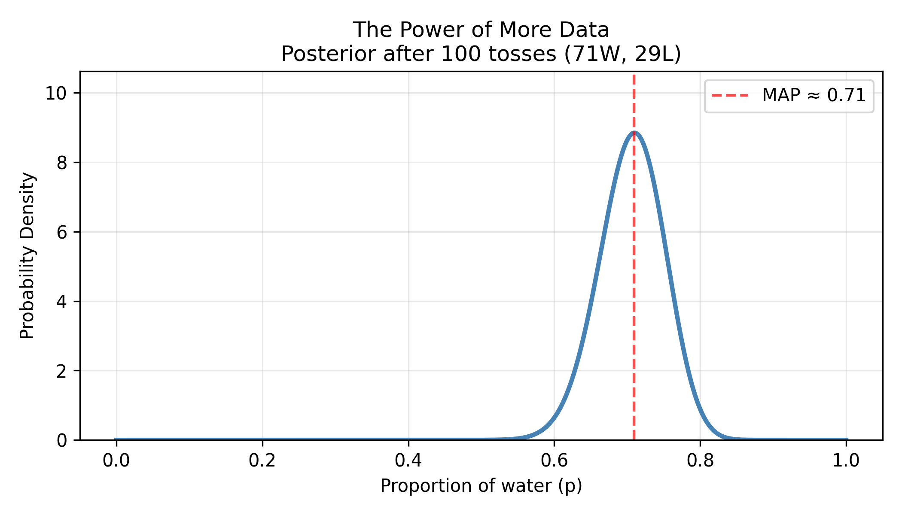

**Figure: Posterior distribution and MAP estimate after 9 tosses**. *The posterior distribution (teal curve) shows our beliefs about the water proportion after observing 6 waters and 3 lands. The distribution peaks around p=0.67, which is the Maximum A Posteriori (MAP) estimate—the single most likely value. However, the distribution has substantial width, indicating uncertainty: plausible values range from roughly 0.45 to 0.85.*

**Two ways to use this distribution:**

**Full Bayesian approach:**
```
"I believe Earth is:
 - 75% water with 40% confidence
 - 70% water with 35% confidence  
 - 67% water with 25% confidence
 - 80% water with 15% confidence
 ..."

Keep the ENTIRE distribution in memory!
```

**MAP approach (what deep learning does):**
```
"Earth is most likely 75% water."
→ Just report the PEAK of the distribution
→ Ignore the rest
```

**Why MAP?**

It's **much faster** and uses **much less memory**. For the globe example, the difference is small. But for AlphaFold predicting protein structures:

```
Full Bayesian:
Store probability for 10^300 possible structures
→ Impossible!

MAP:
Find the single most probable structure
→ Doable in hours!
```

### The Mathematical Connection: Loss Functions

Now let's understand **how** deep learning finds that peak (the MAP estimate).

#### What is a Loss Function?

Think back to the globe example. For each hypothesis (p = 0.25, 0.50, 0.75, etc.), we calculated how many "paths" could produce our data:

```
Hypothesis | Paths (Likelihood) | Which means...
-----------|-------------------|----------------
p = 0.25   | 27 paths          | Somewhat plausible
p = 0.50   | 1 path            | Very implausible!
p = 0.75   | 729 paths         | Very plausible!
```

**We want to find the hypothesis with the MOST paths (highest likelihood).**

Deep learning does this by turning it into an optimization problem:

```
Instead of: "Find hypothesis with most paths"

We say: "Find hypothesis that minimizes 'badness'"

Where "badness" = How unlikely the data is under this hypothesis
```

This "badness" is called the **loss function**.

#### Loss Function = "How Wrong Am I?"

Let's make this concrete with variant calling.

**Scenario:** You're training a neural network to predict if variants are real or sequencing errors.

**Training example:**
- Variant features: 8/10 reads support alternate allele, high base quality
- True label: Real variant (y = 1)

**Your neural network's prediction:** 
- Probability it's real: 0.95 (ŷ = 0.95)

**How do we measure if this prediction is good?**

```
Loss = "How surprised should I be if the true label is y, 
        but my model predicted ŷ?"

If y = 1 (real variant):
  Prediction ŷ = 0.95 → Loss = 0.05 (low! Good prediction!)
  Prediction ŷ = 0.50 → Loss = 0.69 (medium, uncertain)
  Prediction ŷ = 0.10 → Loss = 2.30 (high! Bad prediction!)
```

**The mathematical trick:**

```
Loss = -log(probability of truth)

If model says 95% confident and is correct:
Loss = -log(0.95) = 0.05 ✓

If model says 10% confident but truth is opposite:
Loss = -log(0.10) = 2.30 ✗
```

**Why negative log?**

```
High probability (0.9) → Small negative log (0.1) → Small loss ✓
Low probability (0.1) → Large negative log (2.3) → Large loss ✗

It converts "maximize probability" into "minimize loss"
(Computers are better at minimizing than maximizing!)
```

#### Connecting to Bayesian Likelihood

Remember the Bayesian formula?

```
Posterior ∝ Likelihood × Prior

We want to maximize: P(data | hypothesis)
                      ↑
                  This is likelihood!
```

**In deep learning:**

```
Training objective: Minimize loss across all training examples

Loss = -log P(data | parameters)
       ↑
   This is negative log-likelihood!

Minimizing loss = Maximizing likelihood!
```

**Concrete example:**

You have 3 training variants:

```
Variant 1: True label = Real (1), Model predicts 0.9
  Loss₁ = -log(0.9) = 0.105

Variant 2: True label = Error (0), Model predicts 0.2  
  Loss₂ = -log(0.8) = 0.223  [note: 0.2 for "real" means 0.8 for "error"]

Variant 3: True label = Real (1), Model predicts 0.7
  Loss₃ = -log(0.7) = 0.357

Total Loss = 0.105 + 0.223 + 0.357 = 0.685
```

**Goal of training:** Adjust model parameters (weights) to minimize this total loss!

When loss is minimized → Model's predictions match the data well → We found the maximum likelihood!

### Training = Climbing to the Peak

Now we understand:
- **Loss function** = How badly the model explains the data
- **Minimizing loss** = Maximizing how well the model explains the data
- This is **exactly** what Bayesian inference does with likelihood!

**The training process:**

```
Step 1: Start with random parameters (random hypothesis)
        Loss is high (model explains data poorly)
        Starting point: gray dot at low posterior

Step 2: Adjust parameters slightly
        Calculate new loss
        Did loss decrease? Good! Keep this change.
        Did loss increase? Bad! Try different direction.
        Moving upward: pink dot

Step 3: Continue adjusting parameters
        Loss keeps decreasing
        Model explains data better
        Climbing higher: yellow dot

Step 4: Keep moving toward the peak
        Posterior probability increasing
        Getting closer: yellow dot near top

Step 5: Reach the maximum!
        Found the peak! (MAP estimate)
        Green dot at the highest point
        Stop when loss stops decreasing
```

**Visualizing this:**

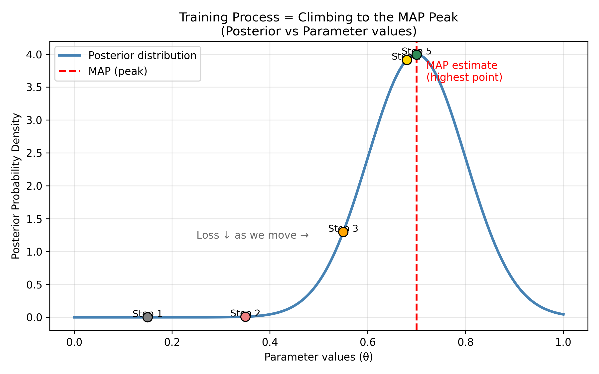

**Figure: Gradient descent climbs to the maximum posterior**. *Training a neural network is like climbing a hill to find the peak. Starting from a random position (Step 1, gray dot at bottom left with low posterior probability), the algorithm iteratively adjusts parameters to move uphill. At each step (Steps 2-5, marked by colored dots), the loss decreases (equivalently, posterior probability increases). The red dashed line marks the Maximum A Posteriori (MAP) estimate—the highest point on the posterior distribution. Step 5 (green dot) reaches the peak, where the model's parameters best explain the observed data. This is gradient ascent on the posterior landscape (or equivalently, gradient descent on the loss landscape).*

This process is called **gradient descent**—we "descend" down the loss landscape (or equivalently, "ascend" up the posterior landscape) to find the peak.

### One More Thing: Preferring Simpler Models

Remember in the globe example, we could use different priors?

```
Uniform prior: All hypotheses equally likely initially
Informative prior: Some hypotheses more likely before seeing data
```

Deep learning has something similar: **preferring simpler models**.

**The idea:**

```
Imagine two models both explain the data perfectly:

Model A: Uses weights [0.3, -0.2, 0.1]
         Simple, small numbers

Model B: Uses weights [25.7, -31.4, 18.9]
         Complex, large numbers

Which do you trust more?
```

Most scientists (and mathematicians) prefer Model A because of **Occam's Razor**: "Simpler explanations are usually better."

**In deep learning, we implement this preference:**

```
Modified Loss = How wrong the model is + Penalty for complexity

Total Loss = Original Loss + (small number) × (sum of weight magnitudes)
                  ↓                              ↓
            Likelihood term              "Prior" that prefers simplicity
```

**Example:**

```
Model A: Loss = 0.50, Weights = [0.3, -0.2, 0.1]
  Total = 0.50 + 0.01 × (0.3 + 0.2 + 0.1) = 0.50 + 0.006 = 0.506

Model B: Loss = 0.45, Weights = [25.7, -31.4, 18.9]
  Total = 0.45 + 0.01 × (25.7 + 31.4 + 18.9) = 0.45 + 0.76 = 1.21

Even though Model B fits data slightly better (0.45 < 0.50),
Model A wins because it's much simpler!
Total: 0.506 < 1.21
```

This complexity penalty is like having a **prior belief** that weights should be small!

```
Bayesian: Prior = "I believe simpler hypotheses are more likely"
Deep Learning: Regularization = "Penalize large weights"

Same idea, different implementation!
```

### Summary: The Bayesian-Deep Learning Dictionary

| Bayesian Inference | Deep Learning | Intuition |
|-------------------|---------------|-----------|
| Likelihood P(data\|hypothesis) | Loss function | "How well does this explain the data?" |
| Maximize likelihood | Minimize loss | Same goal, flipped! |
| Prior P(hypothesis) | Regularization penalty | "Prefer simpler explanations" |
| Posterior P(hypothesis\|data) | Trained model | "Best explanation after seeing data" |
| Full probability distribution | Single best parameters (MAP) | Trade full info for speed |
| Bayesian updating | Training (gradient descent) | Improve guess iteratively |

**Deep learning is Bayesian inference with a practical twist:**
1. **Approximation:** Find single best answer (MAP) instead of full distribution
2. **Optimization:** Turn "maximize posterior" into "minimize loss"
3. **Scale:** Handle millions of parameters efficiently with GPUs
4. **Speed:** Compute in seconds/hours instead of years
5. **Flexibility:** Learn complex non-linear patterns through neural networks

### Why Not Keep the Full Distribution?

**Why do we settle for MAP (single best answer) instead of full Bayesian inference?**

**Computational cost:**

```
Full Bayesian:
"Variant pathogenicity could be:
 65% with 30% confidence,
 70% with 40% confidence,
 60% with 20% confidence, ..."
→ Store and compute with entire distribution
→ Very slow for complex models

Deep Learning (MAP):
"Variant is 67% likely pathogenic"
→ Single number
→ 1000× faster
```

**For real problems:**
- Full Bayesian deep learning: Days to weeks of computation
- Standard deep learning: Minutes to hours
- Difference: 100-1000× speedup

**When full Bayesian deep learning is used:**

Some applications DO keep uncertainty estimates:

```python
# Bayesian Neural Network
predictions = model.predict(variant, num_samples=100)
mean_pred = predictions.mean()
uncertainty = predictions.std()

print(f"Pathogenic: {mean_pred:.1%} ± {uncertainty:.1%}")
# "This variant is 73% ± 12% likely pathogenic"
```

This is valuable when:
- Medical diagnosis (need to know uncertainty!)
- Autonomous vehicles (safety critical)
- Drug discovery (expensive to test, want confidence)
- Scientific discovery (want to know what we don't know)

**Recent research:** Bayesian deep learning is an active area! Methods like:
- Monte Carlo Dropout
- Variational inference
- Ensemble methods

...provide uncertainty estimates at reasonable computational cost.

---

## Why This Connection Matters for Genomics

Understanding the Bayesian foundation of deep learning helps you use AI tools more effectively and critically.

### Interpret Model Confidence Correctly

**Scenario:** A variant predictor outputs "94% pathogenic"

**Without Bayesian thinking:**
*"94% means it's definitely pathogenic!"*

**With Bayesian understanding:**
*"94% is the posterior probability based on training data. But if this variant is very different from training examples—like a novel population or gene—the real uncertainty might be much higher. I should validate experimentally for important decisions."*

**Key questions to ask:**
- Was the model trained on data similar to mine?
- How certain is the model really? (Does it give uncertainty estimates?)
- Is this variant similar to what the model has seen before?

### Understand Why More Data Helps

Remember the globe tossing?
- **9 tosses:** Estimate p = 0.67, but wide uncertainty (0.45 - 0.85)
- **100 tosses:** Estimate p = 0.71, narrow uncertainty (0.62 - 0.79)

**In genomics:**
```
Variant predictor trained on 1,000 variants:
→ Medium confidence, may miss rare patterns

Same predictor trained on 1,000,000 variants:
→ High confidence, better generalization

Why? More data = sharper posterior = more confident predictions!
```

This explains why:
- Large datasets lead to better models
- Models improve over time as more data accumulates
- Rare variant prediction is harder (less training data)

### Recognize When Models Fail

**The out-of-distribution problem:**

```
Training data: 95% European ancestry variants
Your sample: African-specific variant

Bayesian perspective:
"My model learned P(pathogenic | features, European data)
 But you're asking about P(pathogenic | features, African data)
 These can be very different!
 My uncertainty should be HIGH, but standard models won't tell you this."
```

**What this means for you:**
- Be cautious when your data differs from training data
- Check if training data matches your population/condition
- When possible, use models trained on diverse datasets

### Design Better Experiments

**Bayesian thinking guides experimental design:**

```
Goal: Find causal variant for disease

Step 1: Start with highest prior
→ Try exome sequencing (coding variants in known genes)

Step 2: Update based on results
→ Nothing found? Prior for coding variant decreases
→ Expand to whole genome (regulatory regions)

Step 3: Keep updating
→ Still nothing? Consider structural variants, epigenetics

Each negative result updates your beliefs about where to look next!
```

**Practical example:**

You're validating 100 predicted pathogenic variants but can only test 10 in the lab.

**How to choose?**
```
Rank by: (Model confidence) × (Biological plausibility) × (Clinical importance)

This combines:
- Posterior from model (computational evidence)
- Prior from biology (what we know about the gene)  
- Value of information (which answer helps most)
```

This Bayesian approach maximizes what you learn from limited experiments.

---

**The Big Picture:**

Deep learning isn't a black box when you understand its Bayesian foundation:
- **Loss function** = maximize likelihood of data
- **Regularization** = encode prior beliefs
- **Training** = find maximum posterior
- **Predictions** = best guess given what the model learned

This understanding helps you:
- Know when to trust predictions
- Recognize model limitations
- Design better experiments
- Interpret results critically

---

## Math Box: Bayes' Theorem and Components

*You can skip this section and still understand the concepts! This is for those curious about the formal mathematics.*

### The Complete Formula

```
P(H|D) = [P(D|H) × P(H)] / P(D)

Where:
P(H|D) = Posterior - what we want to know
P(D|H) = Likelihood - how well H explains D
P(H) = Prior - what we believed before D
P(D) = Evidence - total probability of seeing D
```

### Calculating Evidence (Normalization)

```
P(D) = Σ P(D|Hᵢ) × P(Hᵢ)  for all hypotheses i
```

This ensures probabilities sum to 1.0!

**Globe example:**

```
P(6W,3L) = P(6W,3L | p=0) × P(p=0)
         + P(6W,3L | p=0.25) × P(p=0.25)
         + P(6W,3L | p=0.50) × P(p=0.50)
         + P(6W,3L | p=0.75) × P(p=0.75)
         + P(6W,3L | p=1) × P(p=1)

         = 0×0.2 + 27×0.2 + 1×0.2 + 729×0.2 + 0×0.2
         = 0 + 5.4 + 0.2 + 145.8 + 0
         = 151.4

Then:
P(p=0.75 | 6W,3L) = (729×0.2) / 151.4 = 145.8 / 151.4 = 96.3%
```

### Binomial Likelihood

For globe-tossing (or any binary outcome repeated n times):

```
L(p | k successes in n trials) = C(n,k) × p^k × (1-p)^(n-k)

Where:
C(n,k) = "n choose k" = n! / (k! × (n-k)!)
       = Number of ways to arrange k successes in n trials

Example: 6 waters in 9 tosses
C(9,6) = 9! / (6! × 3!) = 362880 / (720 × 6) = 84

For p = 0.75:
L(p=0.75) = 84 × 0.75^6 × 0.25^3
          = 84 × 0.178 × 0.0156
          = 0.234 (23.4% chance of seeing this data if p=0.75)
```

### Updating with Each Observation

Bayesian inference can be done sequentially:

```
Posterior after observation 1 becomes prior for observation 2:

After W:    P(p | W)
After W,L:  P(p | W,L) ∝ P(L | p) × P(p | W)
                              ↑
                    This was posterior after W,
                    now becomes prior for L!
```

This is how your brain updates beliefs with each piece of evidence!

---

## Summary

**Key Takeaways:**

1. **You already think like a Bayesian** - Your brain naturally combines prior beliefs with new evidence in daily situations: troubleshooting PCR, interpreting "easy exam" claims, evaluating gene expression changes, and determining if called variants are real

2. **Biology operates on probability distributions** - Gene expression, protein structures, evolution, and immune responses are all inherently stochastic, not deterministic

3. **The globe-tossing example illustrates core Bayesian concepts:**
   - **Prior:** Beliefs before observing data
   - **Likelihood:** How well each hypothesis explains observed data (the "garden of forking paths")
   - **Posterior:** Updated beliefs after observing data
   - **More data → sharper confidence**

4. **Deep learning is practical Bayesian inference:**
   - Loss function ≈ Negative log-likelihood
   - Regularization ≈ Prior
   - Training ≈ Finding maximum posterior (MAP)
   - Trade-off: Full distribution for speed and scalability

5. **Understanding this connection helps you:**
   - Interpret model confidence correctly
   - Recognize when predictions are reliable vs. uncertain
   - Design better training data
   - Combine evidence appropriately
   - Critically evaluate AI tools

6. **Foundation models leverage Bayesian principles:**
   - Pre-training creates an informed prior
   - Fine-tuning updates with task-specific data
   - Enables learning from fewer examples

**The Big Picture:**

```
Your Biological Intuition (already Bayesian)
              ↓
Formalized in Bayes' Theorem
              ↓
Approximated by Deep Learning (for scale)
              ↓
Applied to Genomics (AlphaFold, DeepVariant, etc.)
```

Deep learning isn't magic—it's a practical, scalable implementation of reasoning you already do naturally!

*"All models are wrong, but some are useful." - George Box*

*In biology, we work with probability distributions, not certainties. Bayesian inference and deep learning help us navigate this uncertainty at the scale that modern genomics demands.*

---

## Key Terms

- **Bayesian inference:** Updating beliefs about hypotheses using observed data via Bayes' theorem
- **Prior P(H):** Initial belief about a hypothesis before seeing data
- **Likelihood P(D|H):** Probability of observing data given a hypothesis is true
- **Posterior P(H|D):** Updated belief after observing data
- **Maximum A Posteriori (MAP):** Finding the single most probable hypothesis (what deep learning does)
- **Probability distribution:** Description of all possible values and their probabilities
- **Stochastic:** Involving randomness or probability (not deterministic)
- **Garden of forking paths:** Intuitive visualization of how data arise under different hypotheses
- **Evidence P(D):** Total probability of observing data across all hypotheses (normalization constant)
- **Foundation model:** Model pre-trained on massive data, creating an informed prior for downstream tasks

---

## Test Your Understanding: Can You Answer These?

<details>
<summary><strong>1. You're analyzing a rare variant (chr15:28,197,037 A>G) found in one ASD patient. The variant caller reports "95% confidence." Your lab mate says "95% confident means it's definitely real—let's publish!" What would you tell them using Bayesian reasoning?</strong></summary>

**Answer:**

The 95% confidence is misleading without considering the **prior probability** that a variant is real.

**Bayesian reasoning:**
```
Posterior (is it real?) ∝ Likelihood (evidence from reads) × Prior (how rare are real variants?)

Prior considerations:
• Most genome positions match reference (~99.9%)
• Real rare variants are very uncommon (~0.1% per position)
• Sequencing errors happen (~1-2% in difficult regions)

Additional checks needed:
1. Is this in a repetitive region? (increases error prior)
2. What's the read depth? (10× vs 100× matters!)
3. Is it in gnomAD? (external evidence updates posterior)
4. Does it segregate with disease in family? (genetic evidence)
```

**The key insight:** "95% confidence" from the caller is just the **likelihood** (how well this hypothesis explains the read data). But your true confidence (posterior) must also consider how **rare** real variants are (prior). 

A 95% likelihood × low prior (rare variants) might only give ~60-70% true posterior confidence. You need validation!

**Real-world lesson:** Tools like DeepVariant give you one number, but you need to think Bayesianly about whether to trust it based on biological context.

</details>

<details>
<summary><strong>2. You're doing RNA-seq on cancer vs. normal tissue (n=3 each). Gene X shows: Control = 50 TPM (±5), Cancer = 55 TPM (±8), p=0.04. Your advisor says "p<0.05, so it's differentially expressed—add it to the paper!" Why might this be wrong from a Bayesian perspective?</strong></summary>

**Answer:**

The p-value only tells you the **likelihood** (probability of seeing this data if there's no difference), but ignores the **prior** (how likely is this gene to be truly differentially expressed?) and the **biological uncertainty**.

**Why biology operates on probability distributions, not fixed values:**
```
The measurements you see:
• Control: 50 TPM (±5) → Actually a distribution: [45, 48, 50, 52, 55]
• Cancer: 55 TPM (±8) → Even wider distribution: [47, 52, 55, 58, 63]

These distributions OVERLAP heavily!
• Some control samples: 52-55 TPM
• Some cancer samples: 47-52 TPM
• The "difference" might just be sampling biological noise
```

**Bayesian considerations:**
1. **Effect size:** Only 1.1× fold-change (55/50)—biologically meaningful?
2. **Sample size:** n=3 is tiny—huge uncertainty in the true distribution
3. **Prior:** Is Gene X in a pathway known to be altered in this cancer? If no prior evidence → should be more skeptical
4. **Biological variation:** ±5 vs ±8 shows high variability → distributions overlap substantially

**Better approach:**
- Calculate **posterior probability** that true difference > 1.5× fold-change (biologically meaningful threshold)
- Consider: "Given this data AND what we know about cancer biology, what's the probability this gene is truly differentially expressed?"
- Validate with qRT-PCR or check in TCGA dataset (updating posterior with new evidence!)

**Key principle:** p-values ignore prior knowledge and biological context. Bayesian thinking asks: "Given everything we know, how confident should we really be?"

</details>

<details>
<summary><strong>3. AlphaFold predicts a protein structure with "very high confidence" (pLDDT > 90). But when your experimentalist colleague tries to crystallize it, the structure is completely different. Using the Bayesian framework, explain what went wrong and how AlphaFold's training relates to prior beliefs.</strong></summary>

**Answer:**

AlphaFold's prediction is a **MAP estimate** (maximum a posteriori—single best guess) based on what it learned during training. The error illustrates the **limitation of priors** learned from training data.

**What AlphaFold actually does (Bayesian view):**
```
Prior: Patterns learned from ~200,000 known protein structures in PDB
       (mostly from model organisms, crystallizable proteins, structured domains)
       
Likelihood: How well does each structure explain the amino acid sequence?

Posterior (pLDDT > 90): "Given training data, this structure is highly probable"
```

**What went wrong—Out-of-Distribution Problem:**
```
AlphaFold's "prior" (training data) was biased:
• Trained mostly on: Crystallizable proteins, stable folds, model organisms
• Your protein might be: Intrinsically disordered, membrane protein, human-specific

The "very high confidence" means:
"I'm 90% sure this is correct... IF your protein is like the ones I was trained on"

But your protein is OUT-OF-DISTRIBUTION:
• Different organism/condition than training data
• Post-translational modifications not in training
• Context-dependent folding (in vivo vs in vitro)
• Intrinsically disordered region (not well-represented in PDB)
```

**Deep learning trade-off:**
- ✅ **Fast & scalable:** Can predict millions of structures
- ✅ **Learns complex patterns:** Better than physics-based methods for typical proteins
- ❌ **Overconfident:** Doesn't know what it doesn't know (no uncertainty distribution)
- ❌ **Prior-dependent:** Only as good as training data

**Lesson for genomics:** When using AI tools (DeepVariant, AlphaFold, variant effect predictors):
1. Check if YOUR data matches the training distribution
2. "High confidence" ≠ "definitely correct"—it means "confident based on what I've seen before"
3. Validate experimentally, especially for novel contexts
4. Understand the prior (training data bias)

**Key principle:** Deep learning gives MAP estimates based on training data priors. Always check if your biological question matches what the model was trained on!

</details>

---

## Coding Lab 2: Bayesian Inference with Globe-Tossing

**Objective:** Implement the globe-tossing example and explore Bayesian inference interactively.

**What You'll Learn:**
- Calculate and visualize posterior distributions
- See how beliefs update with each observation
- Understand the effect of different priors
- Explore the impact of sample size on confidence
- Apply Bayesian reasoning to a genomics problem (variant calling)

**Duration:** 60-75 minutes

**You'll implement:**
1. Globe-tossing with different priors (uniform, informative)
2. Visualize posterior evolution with sequential data
3. Compare 9 tosses vs. 100 tosses
4. Apply to variant calling: Is this a real SNP or sequencing error?

**[Open Coding Lab 2 in Google Colab](https://colab.research.google.com/drive/YOUR_LAB2_LINK_HERE)**
